<center>

</center>

# Introduction to Kubernetes


## Objectives
In this lab, you will:
- Use the `kubectl` CLI
- Create a Kubernetes Pod
- Create a Kubernetes Deployment
- Create a ReplicaSet that maintains a set number of replicas
- Witness Kubernetes load balancing in action

>> **Note: Kindly complete the lab in a single session without any break because the lab may go on offline mode and may cause errors. If you face any issues/errors during the lab process, please logout from the lab environment. Then clear your system cache and cookies and try to complete the lab.**


# Verify the environment and command line tools
1. If a terminal is not already open, open a terminal window by using the menu in the editor: `Terminal > New Terminal`.
>> **Note: Please skip this step if the terminal already appears.**

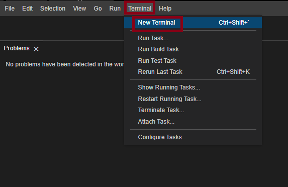 <br>

2. Verify that `kubectl` CLI is installed.
```
kubectl version
```
{: codeblock}

You should see the following output, although the versions may be different:

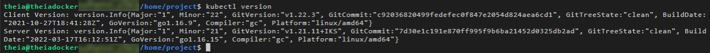 <br>

3. Change to your project folder.
>> **Note: Please skip this step if you are already on the '/home/project' directory**

```
cd /home/project
```
{: codeblock}

4. Clone the git repository that contains the artifacts needed for this lab, if it doesn't already exist.
```
[ ! -d 'CC201' ] && git clone https://github.com/ibm-developer-skills-network/CC201.git
```
{: codeblock}

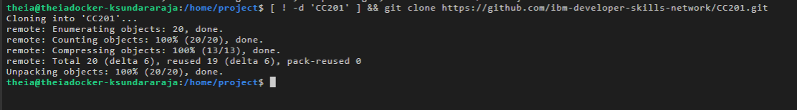 <br>

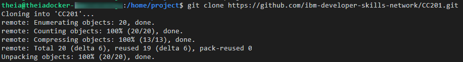 <br>

5. Change to the directory for this lab.
```
cd CC201/labs/2_IntroKubernetes/
```
{: codeblock}


6. List the contents of this directory to see the artifacts for this lab.
```
ls
```
{: codeblock}

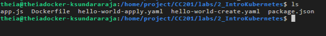 <br>

# Use the `kubectl` CLI
Recall that Kubernetes namespaces enable you to virtualize a cluster. You already have access to one namespace in a Kubernetes cluster, and `kubectl` is already set to target that cluster and namespace.

Let's look at some basic `kubectl` commands.

1. `kubectl` requires configuration so that it targets the appropriate cluster. Get cluster information with the following command:
```
kubectl config get-clusters
```
{: codeblock}

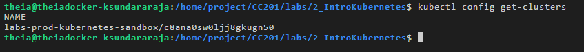 <br>

2. A `kubectl` context is a group of access parameters, including a cluster, a user, and a namespace. View your current context with the following command:
```
kubectl config get-contexts
```
{: codeblock}

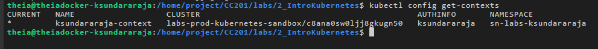 <br>

3. List all the Pods in your namespace. If this is a new session for you, you will not see any Pods.
```
kubectl get pods
```
{: codeblock}

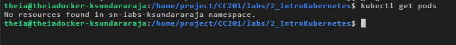 <br>

# Create a Pod with an imperative command
Now it's time to create your first Pod. This Pod will run the `hello-world` image you built and pushed to IBM Cloud Container Registry in the last lab. As explained in the videos for this module, you can create a Pod imperatively or declaratively. Let's do it imperatively first.

1. Export your namespace as an environment variable so that it can be used in subsequent commands.
```
export MY_NAMESPACE=sn-labs-$USERNAME
```
{: codeblock}

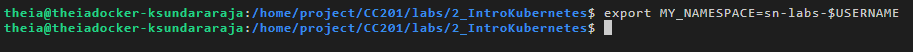 <br>

2. Use the Explorer to view the Dockerfile we'll use to build an image. 

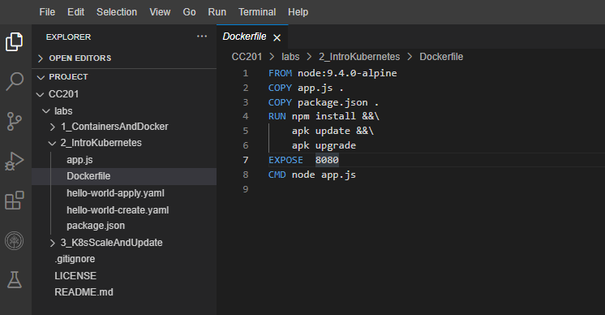 <br>

3. Build and push the image again, as it may have been deleted automatically since you completed the first lab.
```
docker build -t us.icr.io/$MY_NAMESPACE/hello-world:1 . && docker push us.icr.io/$MY_NAMESPACE/hello-world:1
```
{: codeblock}

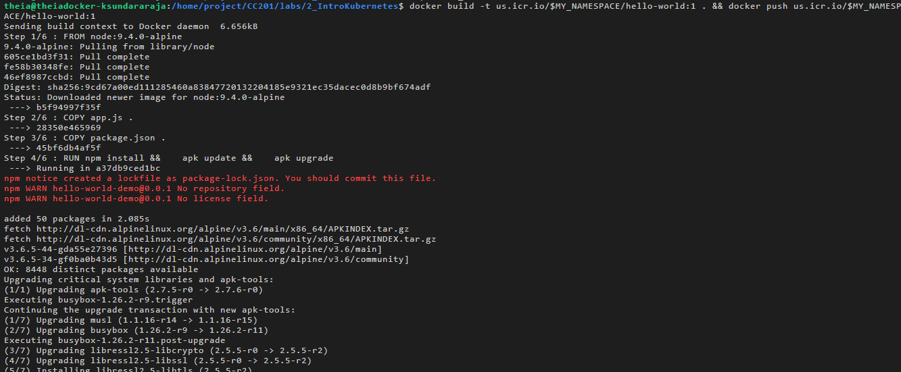 <br>

4. Run the `hello-world` image as a container in Kubernetes.
```
kubectl run hello-world --image us.icr.io/$MY_NAMESPACE/hello-world:1 --overrides='{"spec":{"template":{"spec":{"imagePullSecrets":[{"name":"icr"}]}}}}'
```
{: codeblock}

The `--overrides` option here enables us to specify the needed credentials to pull this image from IBM Cloud Container Registry. Note that this is an imperative command, as we told Kubernetes explicitly what to do: run `hello-world`.

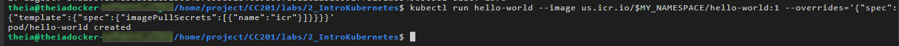 <br>

5. List the Pods in your namespace.
```
kubectl get pods
```
{: codeblock}

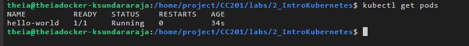 <br>

Great, the previous command indeed created a Pod for us. You can see an auto-generated name was given to this Pod.

You can also specify the wide option for the output to get more details about the resource.
```
kubectl get pods -o wide
```
{: codeblock}

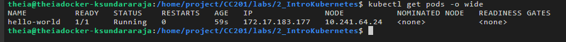 <br>

6. Describe the Pod to get more details about it.
```
kubectl describe pod hello-world
```
{: codeblock}

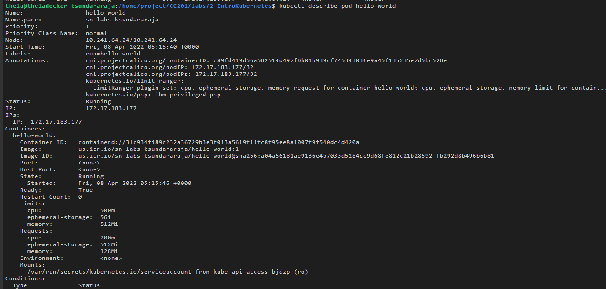 <br>

>>Note: The output shows the pod parameters like **Namespace, Pod Name, IP address, the time when the pod started running** and also the container parameters like **container ID, image name & ID, running status and the memory/CPU limits.**

7. Delete the Pod.
```
kubectl delete pod hello-world
```
{: codeblock}

This command takes a while to execute the deletion of the pod. Please wait till the terminal prompt appears again.

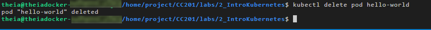 <br>


8. List the Pods to verify that none exist.
```
kubectl get pods
```
{: codeblock}

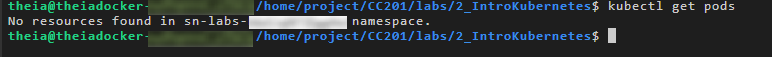 <br>

# Create a Pod with imperative object configuration
Imperative object configuration lets you create objects by specifying the action to take (e.g., create, update, delete) while using a configuration file. A configuration file, `hello-world-create.yaml`, is provided to you in this directory.

1. Use the Explorer to view and edit the configuration file. Click the Explorer icon (it looks like a sheet of paper) on the left side of the window, and then navigate to the directory for this lab: `CC201 > labs > 2_IntroKubernetes`. Click `hello-world-create.yaml` to view the configuration file.

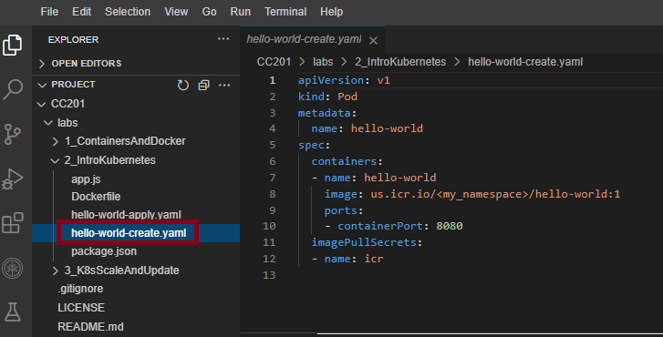 <br>

2. Use the Explorer to edit `hello-world-create.yaml`. You need to insert your namespace where it says `<my_namespace>`. Make sure to save the file when you're done.

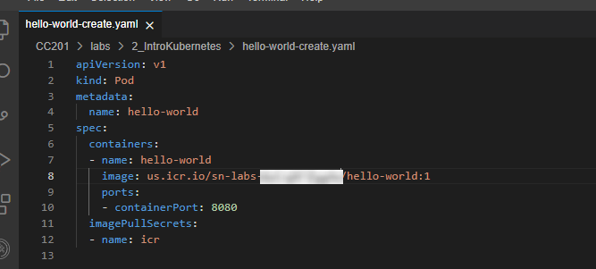 <br>

3. Imperatively create a Pod using the provided configuration file.
```
kubectl create -f hello-world-create.yaml
```
{: codeblock}

Note that this is indeed imperative, as you explicitly told Kubernetes to *create* the resources defined in the file.

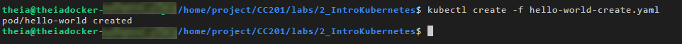 <br>

4. List the Pods in your namespace.
```
kubectl get pods
```
{: codeblock}

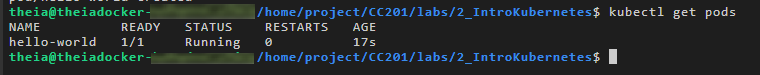 <br>

5. Delete the Pod.
```
kubectl delete pod hello-world
```
{: codeblock}

 This command takes a while to execute the deletion of the pod. Please wait till the terminal prompt appears again.

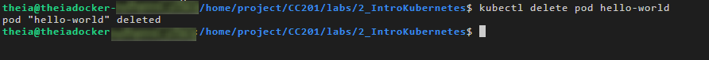 <br>

# Create a Pod with a declarative command
The previous two ways to create a Pod were imperative -- we explicitly told `kubectl` what to do. While the imperative commands are easy to understand and run, they are not ideal for a production environment. Let's look at declarative commands.

1. A sample `hello-world-apply.yaml` file is provided in this directory. Use the Explorer again to open this file. Notice the following:
- We are creating a Deployment (`kind: Deployment`).
- There will be three replica Pods for this Deployment (`replicas: 3`).
- The Pods should run the `hello-world` image (`- image: us.icr.io/<my_namespace>/hello-world:1`).

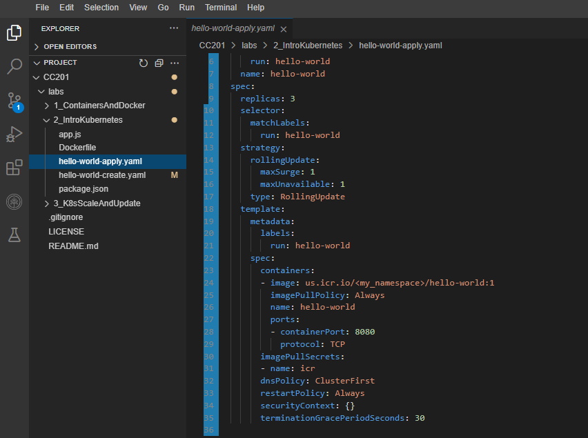 <br>

You can ignore the rest for now. We will get to a lot of those concepts in the next lab.

2. Use the Explorer to edit `hello-world-apply.yaml`. You need to insert your namespace where it says `<my_namespace>`. Make sure to save the file when you're done.

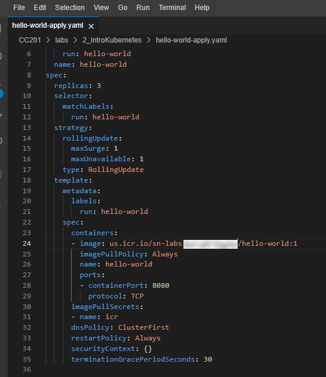 <br>

3. Use the `kubectl apply` command to set this configuration as the desired state in Kubernetes.
```
kubectl apply -f hello-world-apply.yaml
```
{: codeblock}

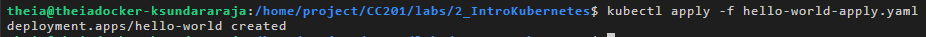 <br>

4. Get the Deployments to ensure that a Deployment was created.
```
kubectl get deployments
```
{: codeblock}

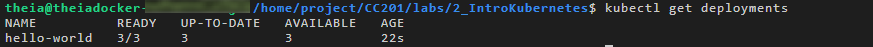 <br>

5. List the Pods to ensure that three replicas exist.
```
kubectl get pods
```
{: codeblock}

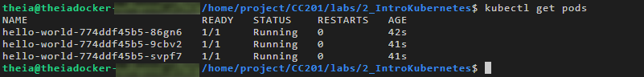 <br>

With declarative management, we did not tell Kubernetes which actions to perform. Instead, `kubectl` inferred that this Deployment needed to be created. If you delete a Pod now, a new one will be created in its place to maintain three replicas.

6. Note one of the Pod names from the previous step, and delete that Pod.
```
kubectl delete pod <pod_name>
```
{: codeblock}

 This command takes a while to execute the deletion of the pod. Please wait till the terminal prompt appears again.

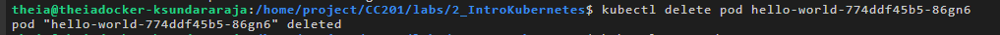 <br>

7. List the Pods to see a new one being created.
```
kubectl get pods
```
{: codeblock}

If you do this quickly enough, you can see one Pod being terminated and another Pod being created.
```
NAME                    READY   STATUS              RESTARTS   AGE
hello-world-dd6b5d745-2jw5s   0/1     Terminating         0          35s
hello-world-dd6b5d745-f9xjk   1/1     Running             0          35s
hello-world-dd6b5d745-m89fc   0/1     ContainerCreating   0          8s
hello-world-dd6b5d745-qvs9t   1/1     Running             0          35s
```
Otherwise, the status of each will be the same, but the age of one Pod will be less than the others and the Pod name will be a new name.
```
NAME                    READY   STATUS    RESTARTS   AGE
hello-world-dd6b5d745-f9xjk   1/1     Running   0          39s
hello-world-dd6b5d745-m89fc   1/1     Running   0          12s
hello-world-dd6b5d745-qvs9t   1/1     Running   0          39s
```

List the Pods to see a new one being created.

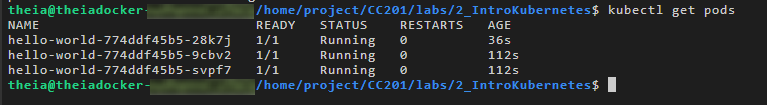 <br>

# Load balancing the application
Since there are three replicas of this application deployed in the cluster, Kubernetes will load balance requests across these three instances. Let's expose our application to the internet and see how Kubernetes load balances requests.

1. In order to access the application, we have to expose it to the internet using a Kubernetes Service.
```
kubectl expose deployment/hello-world
```
{: codeblock}

This command creates what is called a ClusterIP Service. This creates an IP address that accessible within the cluster.

 <br>

2. List Services in order to see that this service was created.
```
kubectl get services
```
{: codeblock}

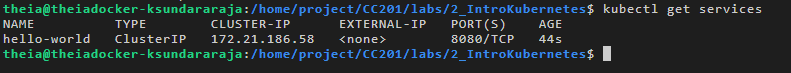 <br>

3. Open a new terminal window using `Terminal > Split Terminal`.

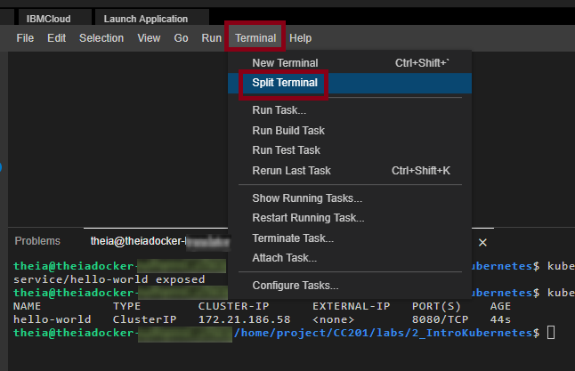 <br>

4. Since the cluster IP is not accessible outside of the cluster, we need to create a proxy. Note that this is not how you would make an application externally accessible in a production scenario. Run this command in the new terminal window since your environment variables need to be accessible in the original window for subsequent commands.
```
kubectl proxy
```
{: codeblock}

This command doesn't terminate until you terminate it. Keep it running so that you can continue to access your app.

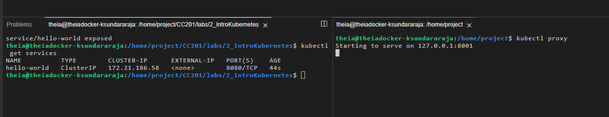 <br>

5. In the original terminal window, ping the application to get a response.
```
curl -L localhost:8001/api/v1/namespaces/sn-labs-$USERNAME/services/hello-world/proxy
```
{: codeblock}

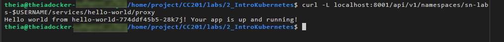 <br>

Notice that this output includes the Pod name.

6. Run the command ten times and note the different Pod names in each line of output.
```
for i in `seq 10`; do curl -L localhost:8001/api/v1/namespaces/sn-labs-$USERNAME/services/hello-world/proxy; done
```
{: codeblock}

You should see more than one Pod name, and quite possibly all three Pod names, in the output. This is because Kubernetes load balances the requests across the three replicas, so each request could hit a different instance of our application.

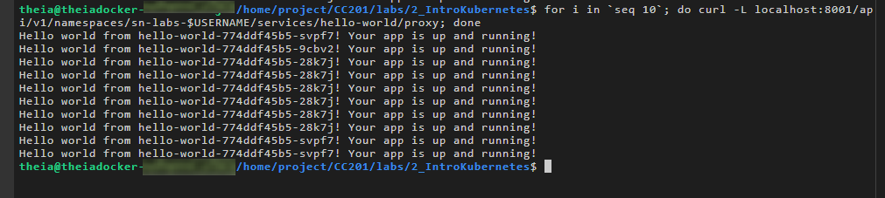 <br>

7. Delete the Deployment and Service. This can be done in a single command by using slashes.
```
kubectl delete deployment/hello-world service/hello-world
```
{: codeblock}

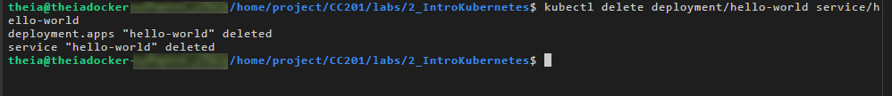 <br>

8. Return to the terminal window running the `proxy` command and kill it using `Ctrl+C`.

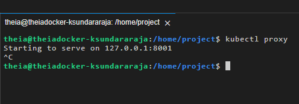 <br>

Congratulations! You have completed the lab for the second module of this course.
