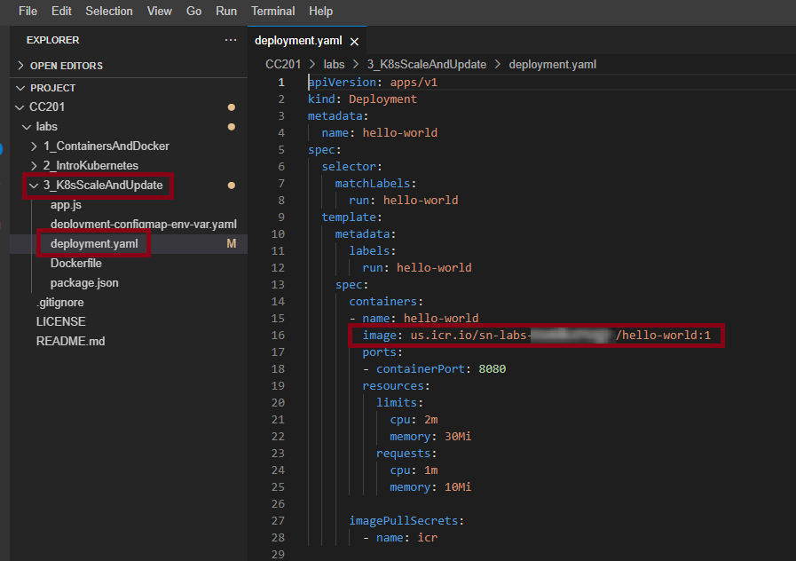
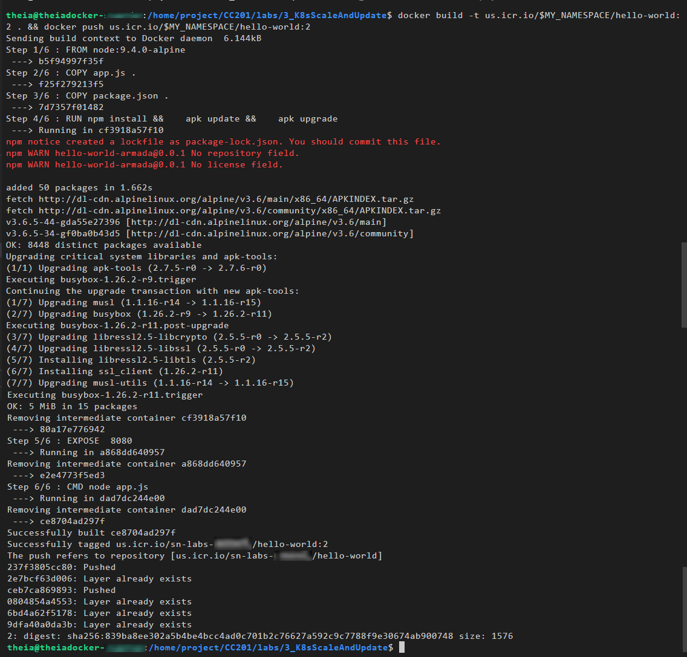
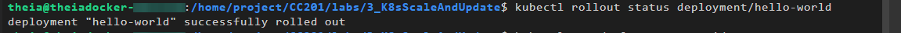
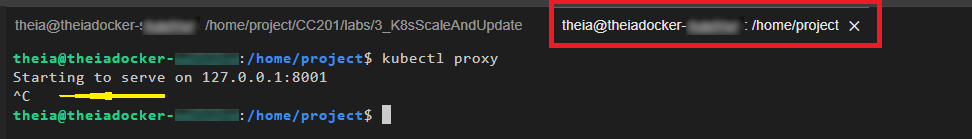

<center>

</center>

# Scaling and Updating Applications

## Objectives
In this lab, you will:
- Scale an application with a ReplicaSet
- Apply rolling updates to an application
- Use a ConfigMap to store application configuration

# Verify the environment and command line tools
1. If a terminal is not already open, open a terminal window by using the menu in the editor: `Terminal > New Terminal`.


2. Change to your project folder.
>> **NOTE:** If you are already in the `/home/project` please skip this step.
```
cd /home/project
```
{: codeblock}

3. Clone the git repository that contains the artifacts needed for this lab, if it doesn't already exist.
```
[ ! -d 'CC201' ] && git clone https://github.com/ibm-developer-skills-network/CC201.git
```
{: codeblock}

<br/>

4. Change to the directory for this lab.
```
cd CC201/labs/3_K8sScaleAndUpdate/
```
{: codeblock}

<br/>

5. List the contents of this directory to see the artifacts for this lab.
```
ls
```
{: codeblock}

<br/>

# Build and push application image to IBM Cloud Container Registry
1. Export your namespace as an environment variable so that it can be used in subsequent commands.
```
export MY_NAMESPACE=sn-labs-$USERNAME
```
{: codeblock}

<br/>

2. Use the Explorer to view the Dockerfile that will be used to build an image.
<br/>

3. Build and push the image again, as it may have been deleted automatically since you completed the first lab.
```
docker build -t us.icr.io/$MY_NAMESPACE/hello-world:1 . && docker push us.icr.io/$MY_NAMESPACE/hello-world:1
```
{: codeblock}

<br/>

# Deploy the application to Kubernetes
1. Use the Explorer to edit `deployment.yaml` in this directory. The path to this file is `CC201/labs/3_K8sScaleAndUpdate/`. You need to insert your namespace where it says `<my_namespace>`. Make sure to save the file when you're done.
>> **NOTE**: To know your namespace, run `echo $MY_NAMESPACE` in the terminal

<br/>

2. Run your image as a Deployment.
```
kubectl apply -f deployment.yaml
```
{: codeblock}

<br/>

3. List Pods until the status is "Running".
```
kubectl get pods
```
{: codeblock}

<br/>

4. In order to access the application, we have to expose it to the internet via a Kubernetes Service.
```
kubectl expose deployment/hello-world
```
{: codeblock}

This creates a service of type **ClusterIP**.

<br/>

5. Open a new terminal window using `Terminal > New Terminal`.
>> **NOTE:** Do not close the terminal window you were working on.
<br/>

6. Cluster IPs are only accesible within the cluster. To make this externally accessible, we will create a proxy. 
>> **Note:** This is not how you would make an application externally accessible in a production scenario. 
Run this command in the new terminal window since your environment variables need to be accessible in the original window for subsequent commands.
```
kubectl proxy
```
{: codeblock}

This command will continue running until it exits. Keep it running so that you can continue to access your app.
<br/>

7. Go back to your original terminal window, ping the application to get a response.
>> **NOTE:** Do not close the terminal window where the `proxy` command is still running.

```
curl -L localhost:8001/api/v1/namespaces/sn-labs-$USERNAME/services/hello-world/proxy
```
{: codeblock}

<br/>

# Scaling the application using a ReplicaSet
In real-world situations, load on an application can vary over time. If our application begins experiencing heightened load, we want to scale it up to accommodate that load. There is a simple `kubectl` command for scaling.

1. Use the `scale` command to scale up your Deployment. Make sure to run this in the terminal window that is not running the `proxy` command.
```
kubectl scale deployment hello-world --replicas=3
```
{: codeblock}

<br/>

2. Get Pods to ensure that there are now three Pods instead of just one. In addition, the status should eventually update to "Running" for all three.
```
kubectl get pods
```
{: codeblock}
<br/>

3. As you did in the last lab, ping your application multiple times to ensure that Kubernetes is load-balancing across the replicas.
```
for i in `seq 10`; do curl -L localhost:8001/api/v1/namespaces/sn-labs-$USERNAME/services/hello-world/proxy; done
```
{: codeblock}
<br/>

You should see that the queries are going to different Pods.

4. Similarly, you can use the `scale` command to scale down your Deployment.
```
kubectl scale deployment hello-world --replicas=1
```
{: codeblock}
<br/>

5. Check the Pods to see that two are deleted or being deleted.
```
kubectl get pods
```
{: codeblock}
<br/>

# Perform rolling updates
Rolling updates are an easy way to update our application in an automated and controlled fashion. To simulate an update, let's first build a new version of our application and push it to Container Registry.

1. Use the Explorer to edit `app.js`. The path to this file is `CC201/labs/3_K8sScaleAndUpdate/`. Change the welcome message from `'Hello world from ' + hostname + '! Your app is up and running!\n'` to `'Welcome to ' + hostname + '! Your app is up and running!\n'`. Make sure to save the file when you're done.
<br/>

2. Build and push this new version to Container Registry. Update the tag to indicate that this is a second version of this application. Make sure to use the terminal window that isn't running the `proxy` command.
>> **NOTE:** Do not close the terminal that is running the `proxy` command

```
docker build -t us.icr.io/$MY_NAMESPACE/hello-world:2 . && docker push us.icr.io/$MY_NAMESPACE/hello-world:2
```
{: codeblock}
<br/>

3. List images in Container Registry to see all the different versions of this application that you have pushed so far.
```
ibmcloud cr images
```
{: codeblock}
<br/>

4. Update the deployment to use this version instead.
```
kubectl set image deployment/hello-world hello-world=us.icr.io/$MY_NAMESPACE/hello-world:2
```
{: codeblock}
<br/>

5. Get a status of the rolling update by using the following command:
```
kubectl rollout status deployment/hello-world
```
{: codeblock}
You should see an output like this, indicating that the rollout succeeded:
<br/>

6. You can also get the Deployment with the `wide` option to see that the new tag is used for the image.
```
kubectl get deployments -o wide
```
{: codeblock}

Look for the `IMAGES` column and ensure that the tag is `2`.
<br/>

7. Ping your application to ensure that the new welcome message is displayed.
```
curl -L localhost:8001/api/v1/namespaces/sn-labs-$USERNAME/services/hello-world/proxy
```
{: codeblock}

<br/>

8. It's possible that a new version of an application contains a bug. In that case, Kubernetes can roll back the Deployment like this:
```
kubectl rollout undo deployment/hello-world
```
{: codeblock}

<br/>

9. Get a status of the rolling update by using the following command:
```
kubectl rollout status deployment/hello-world
```
{: codeblock}

<br/>

10. Get the Deployment with the `wide` option to see that the old tag is used.
```
kubectl get deployments -o wide
```
{: codeblock}

Look for the `IMAGES` column and ensure that the tag is `1`.
<br/>


# Using a ConfigMap to store configuration
ConfigMaps and Secrets are used to store configuration information separate from the code so that nothing is hardcoded. It also lets the application pick up configuration changes without needing to be redeployed. To demonstrate this, we'll store the application's message in a ConfigMap so that the message can be updated simply by updating the ConfigMap.

1. Create a ConfigMap that contains a new message.
```
kubectl create configmap app-config --from-literal=MESSAGE="This message came from a ConfigMap!"
```
{: codeblock}
<br/>

2. Use the Explorer to edit `deployment-configmap-env-var.yaml`. The path to this file is `CC201/labs/3_K8sScaleAndUpdate/`. You need to insert your namespace where it says `<my_namespace>`. Make sure to save the file when you're done.
<br/>

3. In the same file, notice the section reproduced below. The bottom portion indicates that environment variables should be defined in the container from the data in a ConfigMap named `app-config`.
```
containers:
- name: hello-world
  image: us.icr.io/<my_namespace>/hello-world:3
  ports:
  - containerPort: 8080
  envFrom:
  - configMapRef:
    name: app-config
```

4. Use the Explorer to open the `app.js` file. The path to this file is `CC201/labs/3_K8sScaleAndUpdate/`. Find the line that says, `res.send('Welcome to ' + hostname + '! Your app is up and running!\n')`.

Edit this line to look like the following:
```
res.send(process.env.MESSAGE + '\n')
```
{: codeblock}

Make sure to save the file when you're done. This change indicates that requests to the app will return the environment variable `MESSAGE`.
<br/>

5. Build and push a new image that contains your new application code.
```
docker build -t us.icr.io/$MY_NAMESPACE/hello-world:3 . && docker push us.icr.io/$MY_NAMESPACE/hello-world:3
```
{: codeblock}

The `deployment-configmap-env-var.yaml` file is already configured to use the tag `3`.
<br/>

6. Apply the new Deployment configuration.
```
kubectl apply -f deployment-configmap-env-var.yaml
```
{: codeblock}
<br/>

7. Ping your application again to see if the message from the environment variable is returned.
>> **NOTE:** You can run this command again. As it may not show the `"This message came from a ConfigMap!"` message right away.
```
curl -L localhost:8001/api/v1/namespaces/sn-labs-$USERNAME/services/hello-world/proxy
```
{: codeblock}

If you see the message, "This message came from a ConfigMap!", then great job!
<br/>

8. Because the configuration is separate from the code, the message can be changed without rebuilding the image. Using the following command, delete the old ConfigMap and create a new one with the same name but a different message.
```
kubectl delete configmap app-config && kubectl create configmap app-config --from-literal=MESSAGE="This message is different, and you didn't have to rebuild the image!"
```
{: codeblock}
<br/>

9. Restart the Deployment so that the containers restart. This is necessary since the environment variables are set at start time.
```
kubectl rollout restart deployment hello-world
```
{: codeblock}
<br/>

10. Ping your application again to see if the new message from the environment variable is returned.
```
curl -L localhost:8001/api/v1/namespaces/sn-labs-$USERNAME/services/hello-world/proxy
```
{: codeblock}
<br/>

11. Delete the Deployment.
```
kubectl delete -f deployment-configmap-env-var.yaml
```
{: codeblock}
<br/>

12. Delete the Service.
```
kubectl delete service hello-world
```
{: codeblock}
<br/>

13. Return to the other terminal window that is running the `proxy` command and kill it using `Ctrl+C`.
<br/>

Congratulations! You have completed the lab for the third module of this course.
