<center>

</center>

# Introduction to Red Hat OpenShift

## Objectives
In this lab, you will:
- Use the `oc` CLI (OpenShift command line interface)
- Use the OpenShift web console
- Build and deploy an application using s2i ('Source-to-image' build strategy)
- Inspect a BuildConfig and an ImageStream

# Verify the environment and command line tools
1. If a terminal is not already open, open a terminal window by using the menu in the editor: `Terminal > New Terminal`.
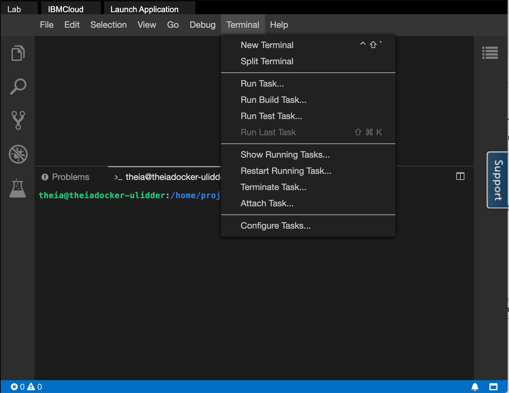

2. Verify that `oc` CLI is installed.
```
oc version
```
{: codeblock}

You should see output similar to this, although the versions may be different:

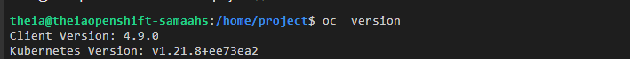 <br>

3. Change to your project folder.

> **NOTE:** If you are already on `home/project` please skip this step

```
cd /home/project
```
{: codeblock}

4. Clone the git repository that contains the artifacts needed for this lab, if it doesn't already exist.
```
[ ! -d 'CC201' ] && git clone https://github.com/ibm-developer-skills-network/CC201.git
```
{: codeblock}

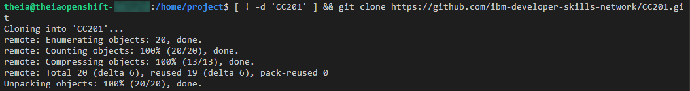 <br>

# Use the `oc` CLI
OpenShift projects are Kubernetes namespaces with additional administrative functions. Therefore, projects also provide isolation within an OpenShift cluster. You already have access to one project in an OpenShift cluster, and `oc` is already set to target that cluster and project.

Let's look at some basic `oc` commands. Recall that `oc` comes with a copy of `kubectl`, so all the `kubectl` commands can be run with `oc`.

1. List the Pods in this namespace.
```
oc get pods
```
{: codeblock}

You will likely see a few Pods that are part of the environment. You don't need to worry about these.

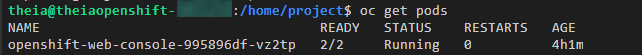 <br>

2. In addition to Kubernetes objects, you can get OpenShift specific objects.
```
oc get buildconfigs
```
{: codeblock}

Because you haven't created a BuildConfig yet, this will not return any resources.

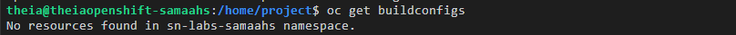 <br>

3. View the OpenShift project that is currently in use.
```
oc project
```
{: codeblock}

This project is specific to you and provides isolation within the cluster so that you can deploy your own applications.

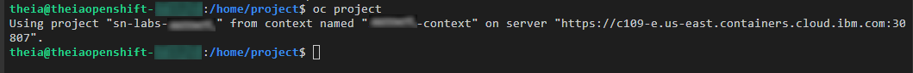 <br>

# Use the OpenShift web console
In addition to the CLI, OpenShift provides an intuitive web console. This is a useful and powerful feature because it enables you to deploy applications, view resources, monitor applications and view logs, and much more right in the console.

Let's open up the console and have a look around.

1. Open the OpenShift web console using the link at the top of the lab environment. It can take a few minutes to become available after opening the lab environment, so if you get an error, wait a minute and try again.


2. The console should open to the project details for the project you have been assigned. Take a look at all the information OpenShift provides you in an intuitive, visual manner. Click through the Dashboard, Overview, and other tabs for this project to see additional information. You should see inventory on the resources that currently exist in this project, the YAML that defines this project, and much more.

3. Familiarize yourself with the items in the left navigation menu. You can see Operators, many different Kubernetes objects, and some OpenShift-specific objects, all of which we have talked about in this course. There won't yet be many instances of these objects, but they will fill up once we deploy our application.

4. Notice the word **"Administrator"** at the top left. This indicates that you are in the Administrator perspective. There is also a Developer perspective. Each perspective provides workflows specific to that persona. **Switch to the Developer perspective** to begin deploying an application. (If it says "Developer" already, don't change it.)

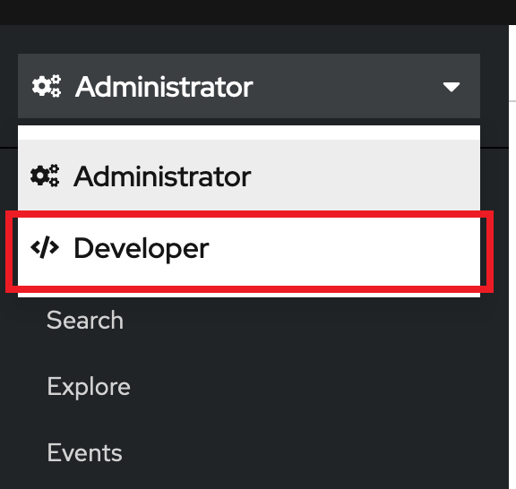 <br>


# Deploy an application in the web console
The Developer perspective provides workflows specific to developer use cases, such as the ability to create and deploy applications. Let's start here! You are likely in the "Topology" view, which provides a visual representation of applications. If not, switch to it to take a look.

1. Let us add a new application to this project. There are several ways to add a new application in Openshift.

2. Click the **+Add** button to add a new application.

3. Select **From Git** among the options.


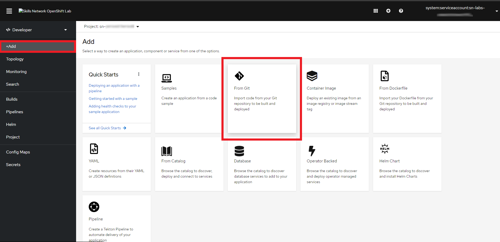 <br>


4. You will be redirected to **Import from Git** window. OpenShift will deploy an application using only one input from you: the application source.

5. In the **Git Repo URL** box, paste the sample one mentioned below. 

```
https://github.com/sclorg/nodejs-ex.git
```
{: codeblock}

In the Builder section, scroll down to see the various builder images. We shall be using the Node.js image for our application. Ensure that this image has been selected.

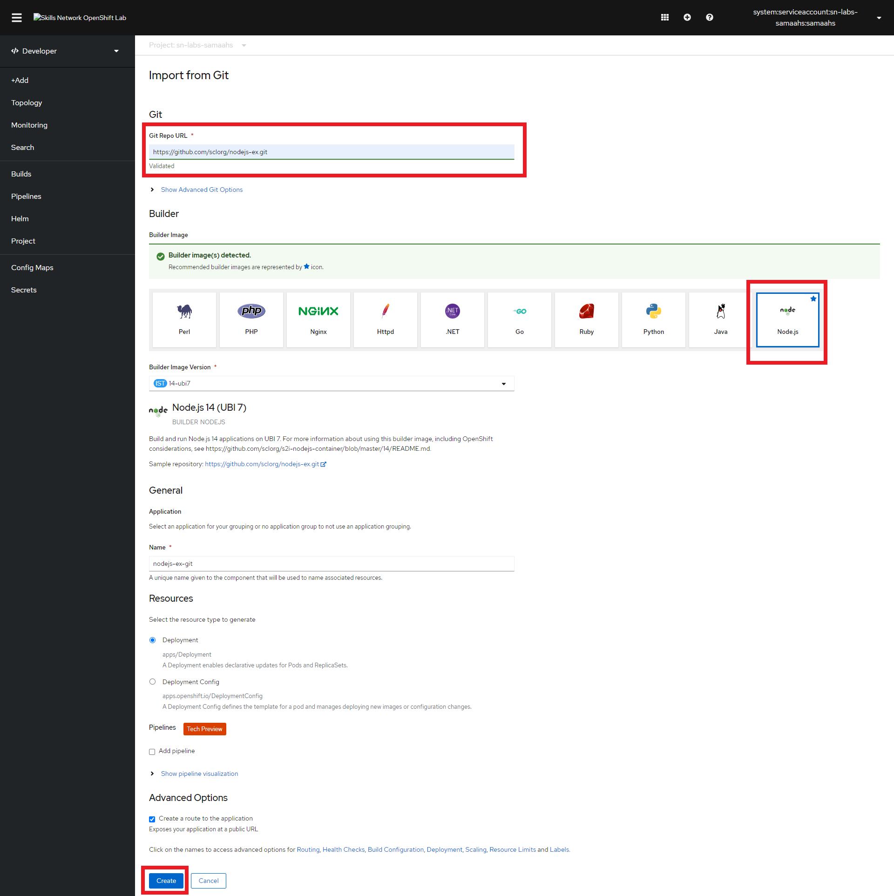 <br>


6. Keep the rest of the default options as they already are. Then scroll down and click **Create**.

In the Topology view, you should now see your newly created application.
> **NOTE:** It will take several minutes for the application to appear. Refresh the browser if within 3 minutes, you don't see any application.

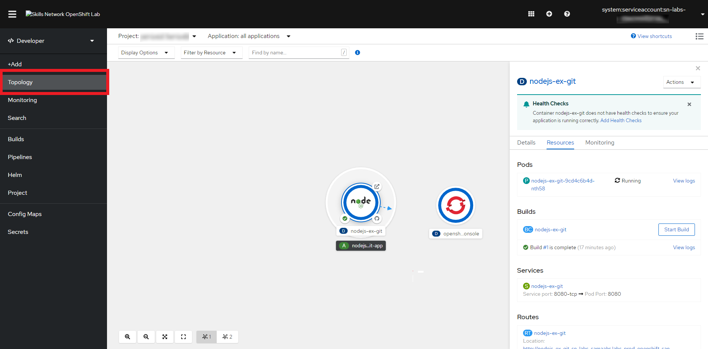 <br>

# View application in the web console
The Topology view provides quick links to a lot of important parts of an application:
* The outer circle gets the information on the application.
* The inner circle with the Node.js logo gives information about the Deployment.
* The GitHub icon is used to access the code repository.
* The check mark shows the most recent build (you will see circular arrows if the build is in progress).
* The arrow coming out of a box can be used to view the application in the browser if the application is externally available.

Let's try some specific steps:
<!-- Step 1 and 2 combined -->
1. Click the inner circle with the Node.js logo to bring up information on the Deployment and observe the four resources associated with this Deployment: a Pod that runs the containerized application; a Build that uses the s2i strategy to build the application into a container image; a Service that exposes the application as a network service; and a Route that provides an externally reachable hostname.

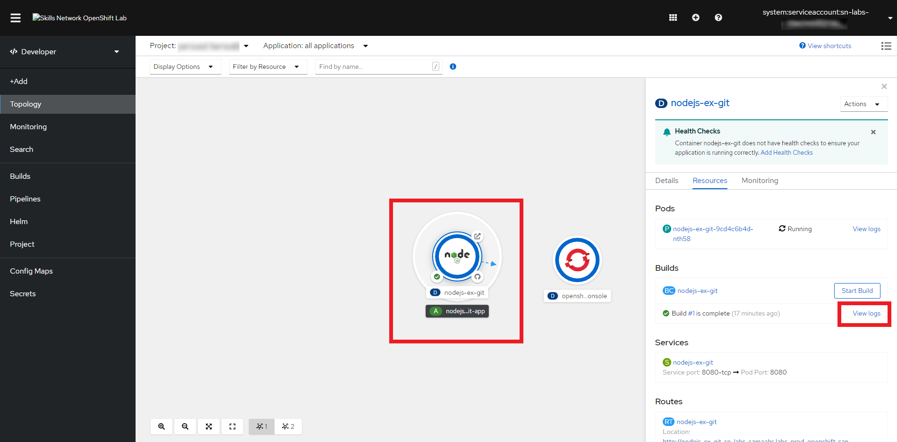 <br>


2. Click **View logs** on the line that says **Build #1**.

<!-- earlier step 3 now 2 and so on till the end -->

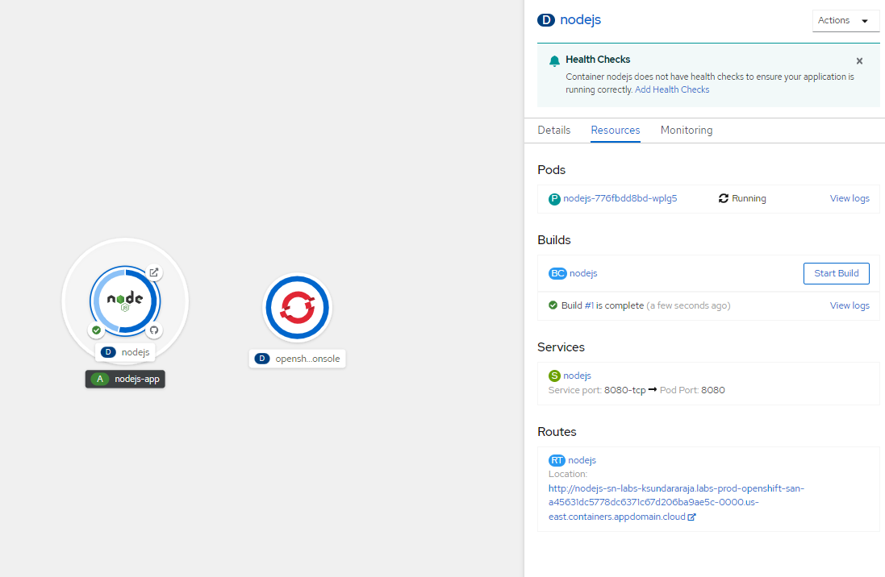

3. Read the logs to see a few key completed steps. The repository is cloned, a Dockerfile is generated, an image is built, and the image is pushed to the internal registry.

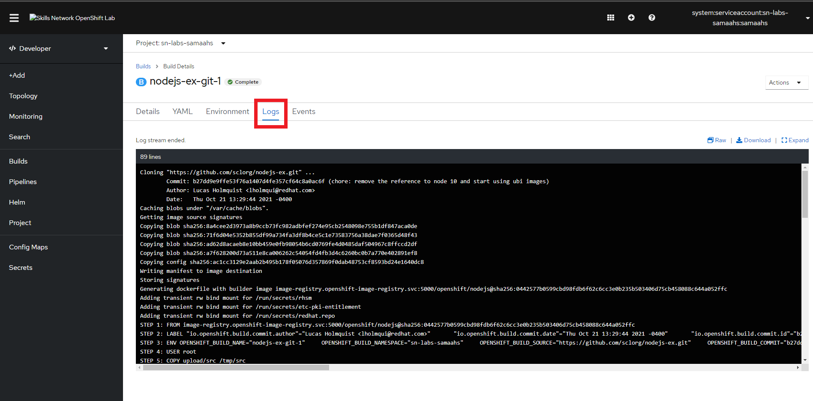 <br>

4. Click the **Details** tab for this Build.

5. And then click the link under **Owner** (at the very bottom) that says BC (Build Config).

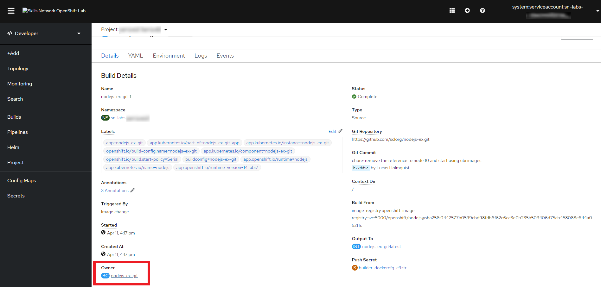 <br>

6. If you look at the **Details** and **YAML** tabs, you'll see many concepts that we talked about in this module: triggers, build strategy, webhooks, and more.

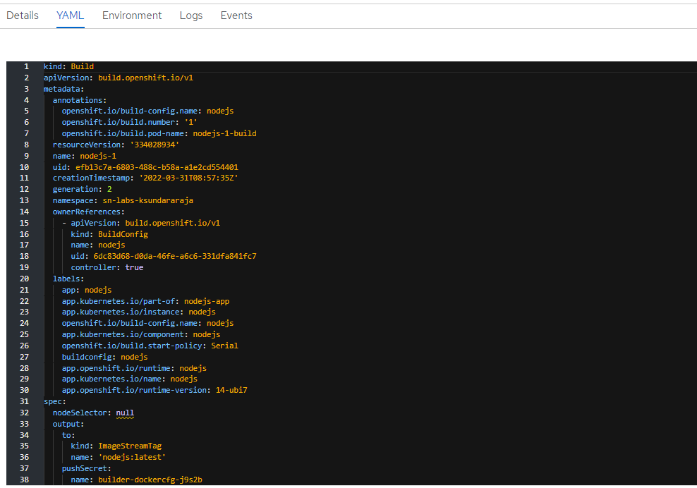

7. On the **Details** tab, click the link under **Output To** that says IST (ImageStreamTag).

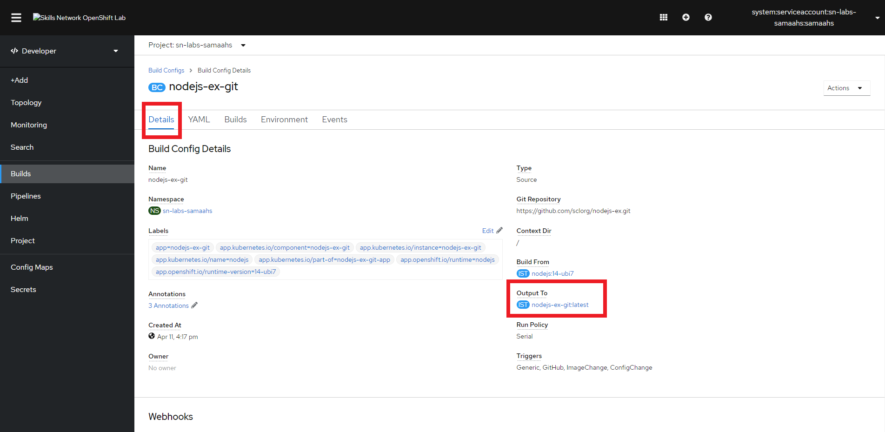 <br>

8. You can now see the ImageStreamTag that was created as an output of the build. Click the **History** tab to see the image in the internal registry to which this ImageStreamTag points.

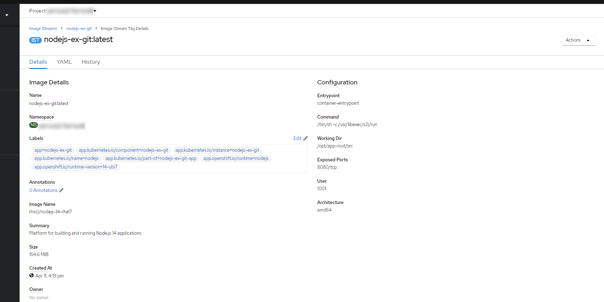 <br>

9. Return to the Topology view and click on your Deployment info. Click the Route that OpenShift automatically created for you. This will open the application in the browser.

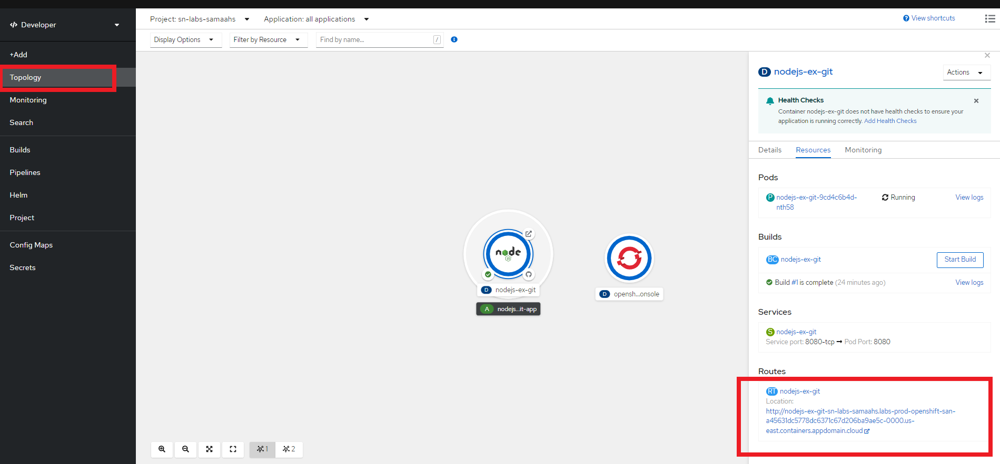 <br>

Wow! OpenShift did some pretty incredible work on your behalf. All it needed was a code repository and it was able to build the code into a container image, push that image to a registry, create a Deployment that references that image, and also expose the application to the internet with a hostname.


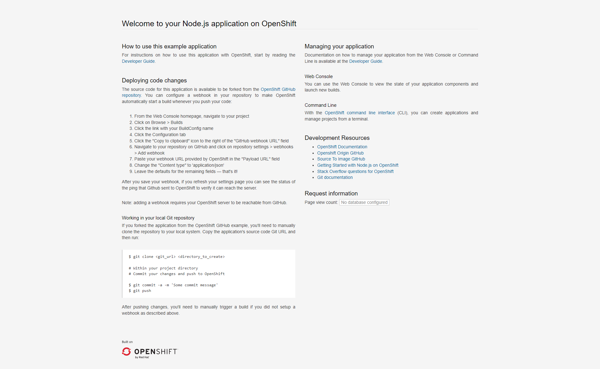 <br>

Congratulations! You have completed the lab for the fourth module of this course.

>**Note: Please delete your project from Openshift Console & SN labs environment before signing out to ensure that further labs requiring the use of OpenShift console run correctly.**

> **For OpenShift project deletion:**

>> 1. Go to the `Project` tab on the OpenShift console. Click on `Actions` & select `Delete Project`.

>> 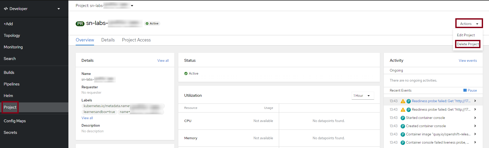 <br>

>> 2. Type your project name to confirm deletion as below.

>> 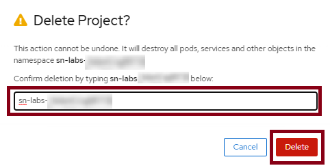 <br>

> **For SN labs project deletion:**

>> 1. Go to the Explorer view on SN labs and right click on the project name & select `Delete`.

>> 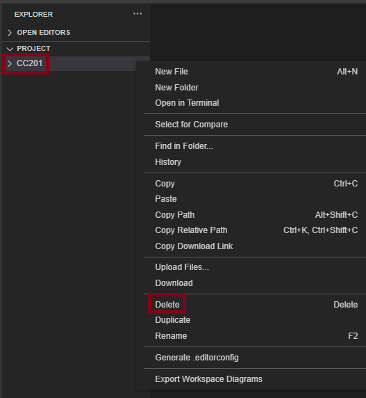 <br>


## Changelog

| Date       | Version | Changed by     | Change Description                |
| ---------- | ------- | -------------- | --------------------------------- |
| 2022-04-08 | 1.1     | Samaah Sarang  | Updated Lab instructions & images |
| 2022-04-13 | 1.2     | Samaah Sarang  | Updated Lab instructions & images |
| 2022-04-14 | 1.3     | K Sundararajan | Updated Lab instructions & images                                  |

## <h3 align="center"> © IBM Corporation 2022. All rights reserved. <h3/>
