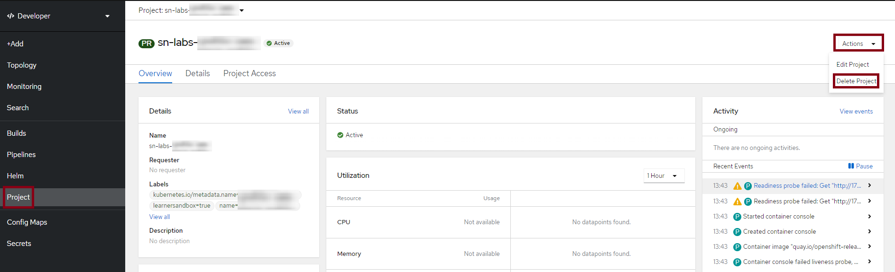
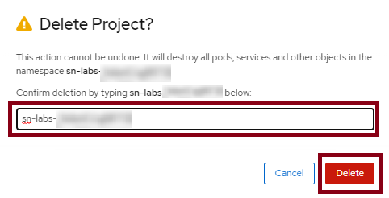
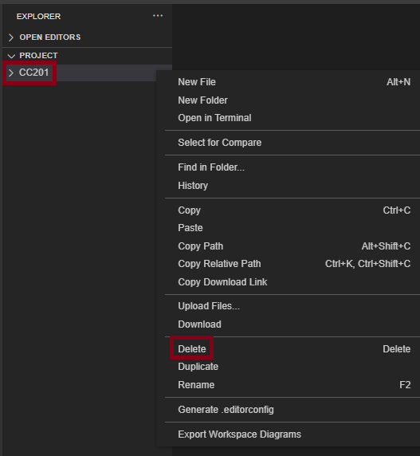

# Deletion of project from OpenShift console & SN labs

## Objectives
In this lab, you will:
- Delete your existing project from OpenShift console.
- Delete your existing project from SN labs.

**For OpenShift project deletion:**

1. Go to the `Project` tab on the OpenShift console. Click on `Actions` & select `Delete Project`.

  

2. Type your project name to confirm deletion as below.

  

**For SN labs project deletion:**

1. Go to the Explorer view on SN labs and right click on the project name & select `Delete`.

  

## Changelog

| Date       | Version | Changed by     | Change Description                |
| ---------- | ------- | -------------- | --------------------------------- |
| 2022-04-14 | 1.1     | K Sundararajan  | Initial version created           |
                                |

## <h3 align="center"> © IBM Corporation 2022. All rights reserved. <h3/>
