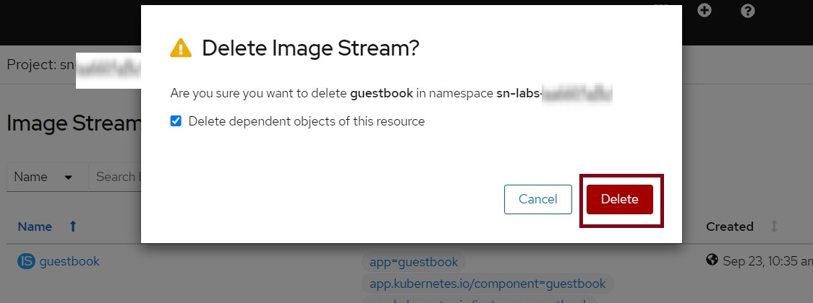
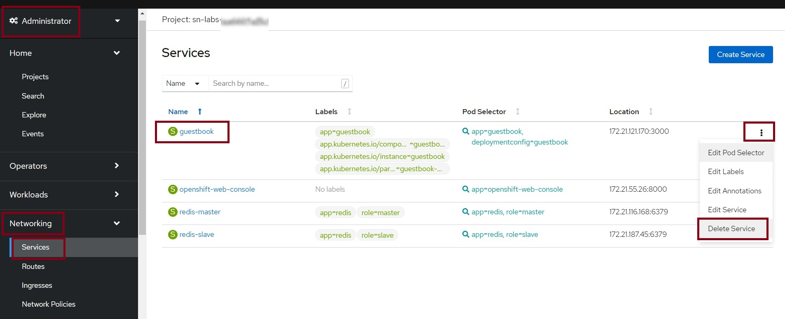
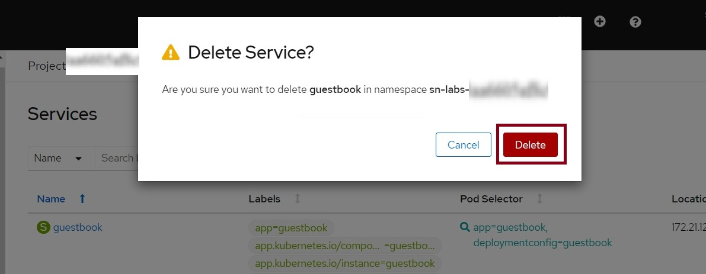
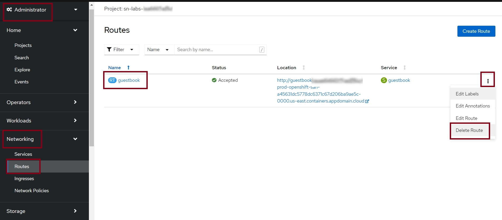
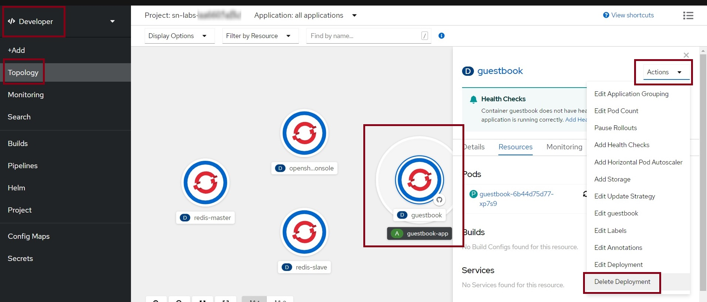
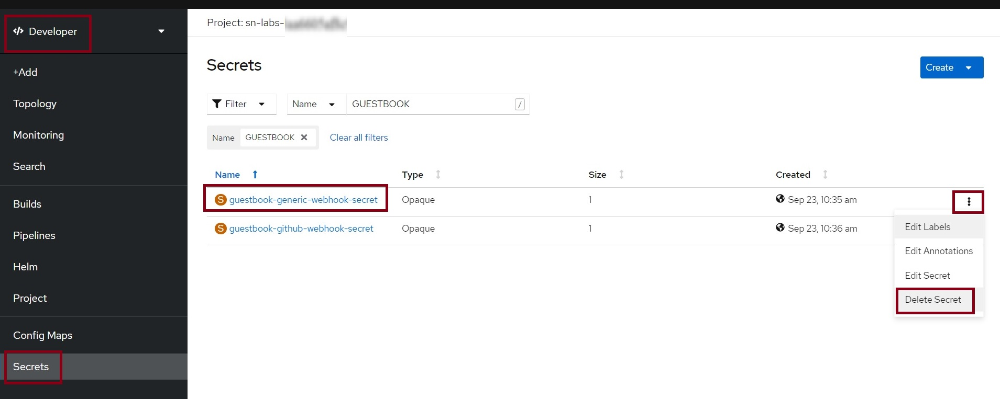
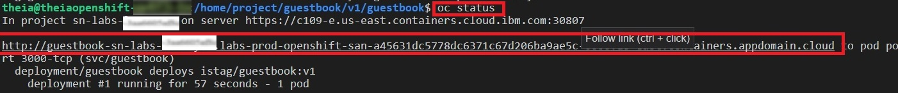

# Session Parameters Deletion

**Estimated Time Needed:** 20 minutes

## Objectives

* In this lab, you will delete the below parameters of the `guestbook` image for creating the deployment again in the same session.

- Image Stream
- Service
- Route
- Build Config
- Deployment
- Secret


## Deleting the Image Stream

1. In the **Administrator Perspective** select **Builds** >> **Image Streams**.

2. Click on the 3 dots at the right of the `guestbook` Image Stream and click on **Delete Image Stream**.

--img--

3. Click on **Delete** in the confirmation pop-up.




## Deleting the Service

1. In the **Administrator Perspective** select **Networking** >> **Services**.

2. Click on the 3 dots at the right of the `guestbook` service and click on **Delete Service**.



3. Click on **Delete** in the confirmation pop-up.



## Deleting the Route

1. In the **Administrator Perspective** select **Networking** >> **Routes**.

2. Click on the 3 dots at the right of the `guestbook` service and click on **Delete Route**.



## Deleting the Build Config

1. In the **Developer Perspective** click on **Builds**.

2. Click on the 3 dots at the right of the `guestbook` Build Config and click on **Delete Build Config**.


## Deleting the Deployment

1. In the **Developer Perspective** go to **Topology** and click on the `guestbook` deployment.

2. Click on **Actions** and then click on **Delete Deployment**.



## Deleting the Secrets

1. In the **Developer Perspective** click on **Secrets**.

2. Click the **Filter** option. Type the name as **GUESTBOOK** under `Name` and press `Enter` to retrieve the secrets pertaining to the `guestbook` image.

3. Click on the 3 dots at the right of  **guestbook-generic-webhook-secret** and click on **Delete Build Config**. Do the same for **guestbook-github-webhook-secret** & other `guestbook` secrets, if any.




## Next Steps

- The above session paramters pertaining to your current `guestbook` image will be deleted after the above steps. You can create the `guestbook` deployment again and proceed further.

* If you do not see any route to your `guestbook` app  after creating the deployment again, please run the below command in the terminal to get the route:

```sh
oc status
```




## Author
K Sundararajan

## Changelog
| Date | Version | Changed by | Change Description |
|------|--------|--------|---------|
| 29-09-2022 | 1.0 | K Sundararajan | Initial version created |
