<center>

</center>

# Optional: Deploy guestbook app from the OpenShift internal registry

## Objectives
In this lab, you will:
- Build and deploy a simple guestbook application
- Use OpenShift image streams to roll out an update
- Deploy a multi-tier version of the guestbook application

## Pre-requisite
You must have built and pushed the Guestbook application using the Docker commands as given in the Final Assignment.

> **Note:** Kindly click on the OpenShift console tab and check if you have any existing project. If yes, then follow this <a href='https://cf-courses-data.s3.us.cloud-object-storage.appdomain.cloud/cc201/labs/4_IntroOpenShift/oc___snlabs_proj_deletion.md.html'>link</a> to delete the same first to avoid any issues with the lab. Otherwise, you are all set to perform the lab.

## Deploy guestbook app from the OpenShift internal registry

As discussed in the course, IBM Cloud Container Registry scans images for common vulnerabilities and exposures to ensure that images are secure. But OpenShift also provides an internal registry -- recall the discussion of image streams and image stream tags. Using the internal registry has benefits too. For example, there is less latency when pulling images for deployments. What if we could use both—use IBM Cloud Container Registry to scan our images and then automatically import those images to the internal registry for lower latency?

1. Create an image stream that points to your image in IBM Cloud Container Registry.
```
oc tag us.icr.io/$MY_NAMESPACE/guestbook:v1 guestbook:v1 --reference-policy=local --scheduled
```
{: codeblock}

With the `--reference-policy=local` option, a copy of the image from IBM Cloud Container Registry is imported into the local cache of the internal registry and made available to the cluster's projects as an image stream. The `--schedule` option sets up periodic importing of the image from IBM Cloud Container Registry into the internal registry. The default frequency is 15 minutes.

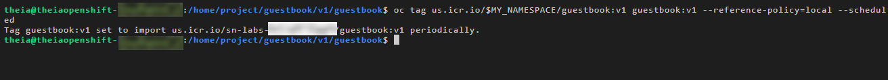 <br>

Now let's head over to the OpenShift web console to deploy the guestbook app using this image stream.

2. Open the OpenShift web console using the link at the top of the lab environment.

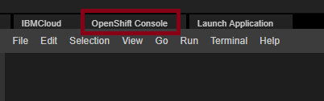 <br>

> **Note:** Currently we are experiencing certain difficulties with the OpenShift console . If your screen takes time in loading, please close the OpenShift console browser tab & re-launch the same. It may take upto 10 mins to load the screen.

3. From the Developer perspective, click the **+Add** button to add a new application to this project.

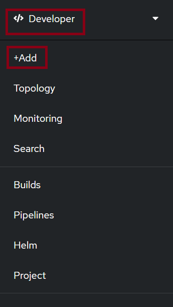 <br>

4. Click the **Container Image** option so that we can deploy the application using an image in the internal registry.

 <br>

5. Under **Image**, switch to "**Image stream tag from internal registry**".

 <br>

6. Select your project, and the image stream and tag you just created (`guestbook` and `v1`, respectively). You should have only have one option for each of these fields anyway since you only have access to a single project and you only created one image stream and one image stream tag.

 <br>

7. Keep all the default values and hit **Create** at the bottom. This will create the application and take you to the Topology view.

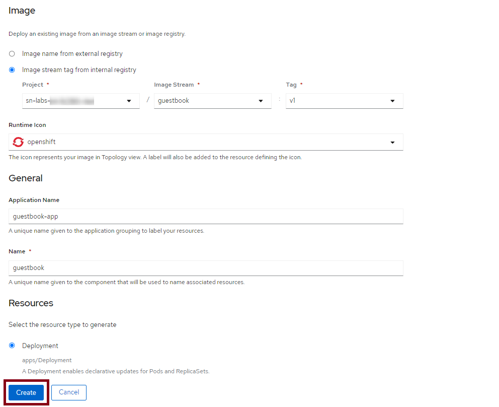 <br>

8. From the Topology view, click the `guestbook` Deployment. This should take you to the **Resources** tab for this Deployment, where you can see the Pod that is running the application as well as the Service and Route that expose it.
>> **Kindly wait as the deployments in the Topology view may take time to get running.**

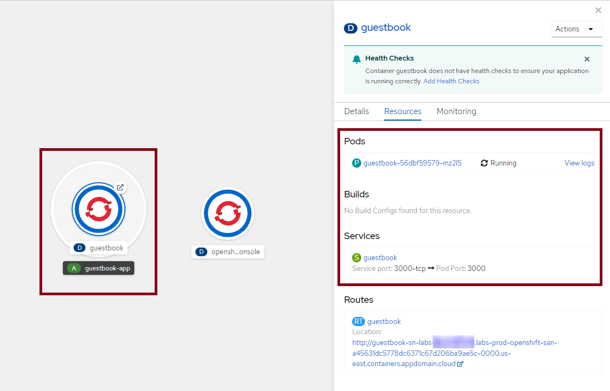 <br>

>> **Note: Kindly do not delete the `opensh.console` deployment in the Topography view as this is essential for the OpenShift console to function properly.**

9. Click the Route location (the link) to view the guestbook in action. 

> **Note:** Please wait for status of the pod to change to **'Running'** before launching the app.

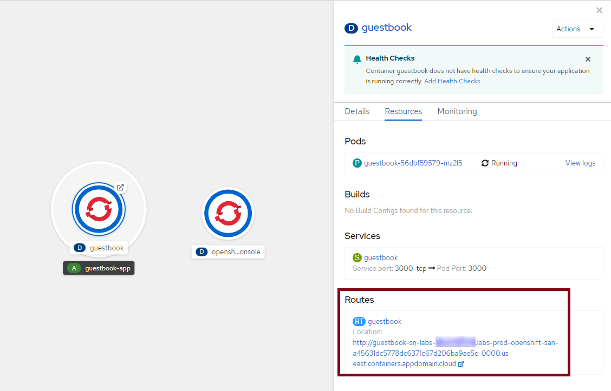 <br>

10. Try out the guestbook by putting in a few entries. You should see them appear above the input box after you hit **Submit**.

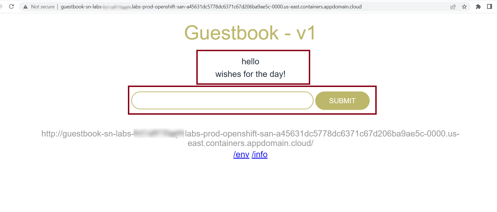 <br>

# Update the guestbook
Let's update the guestbook and see how OpenShift's image streams can help us update our apps with ease.

1. Use the Explorer to edit `index.html` in the `public` directory. The path to this file is `guestbook/v1/guestbook/public/index.html`.

 <br>

2. Let's edit the title to be more specific. On line number 12, that says `<h1>Guestbook - v1</h1>`, change it to include your name. Something like `<h1>Alex's Guestbook - v1</h1>`. Make sure to save the file when you're done.

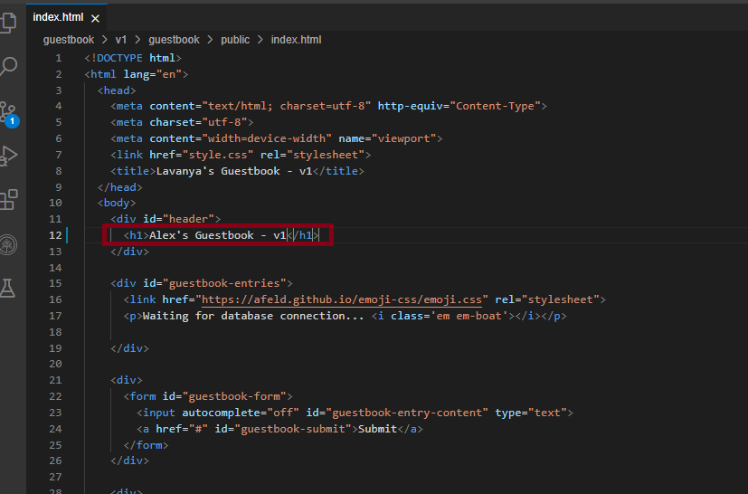 <br>

3. Build and push the app again using the same tag. This will overwrite the previous image.
```
docker build . -t us.icr.io/$MY_NAMESPACE/guestbook:v1 && docker push us.icr.io/$MY_NAMESPACE/guestbook:v1
```
{: codeblock}

 <br>

4. Recall the `--schedule` option we specified when we imported our image into the OpenShift internal registry. As a result, OpenShift will regularly import new images pushed to the specified tag. Since we pushed our newly built image to the same tag, OpenShift will import the updated image within about 15 minutes. If you don't want to wait for OpenShift to automatically import the image, run the following command.
```
oc import-image guestbook:v1 --from=us.icr.io/$MY_NAMESPACE/guestbook:v1 --confirm
```
{: codeblock}

 <br>

5. Switch to the **Administrator** perspective so that you can view image streams.

 <br>

6. Click **Builds** > **Image Streams** in the navigation.

 <br>

7. Click the `guestbook` image stream.

 <br>

8. Click the **History** menu. If you only see one entry listed here, it means OpenShift hasn't imported your new image yet. Wait a few minutes and refresh the page. Eventually you should see a second entry, indicating that a new version of this image stream tag has been imported. This can take some time as the default frequency for importing is 15 minutes. 

 <br>

9. Return to the **Developer** perspective.

 <br>

>> **Note: Please wait for some time for the OpenShift console & the Developer perspective to load.**

10. View the guestbook in the browser again. If you still have the tab open, go there. If not, click the Route again from the `guestbook` Deployment. You should see your new title on this page! OpenShift imported the new version of our image, and since the Deployment points to the image stream, it began running this new version as well.


 <br>

# Guestbook storage
1. From the guestbook in the browser, click the `/info` link beneath the input box. This is an information endpoint for the guestbook.

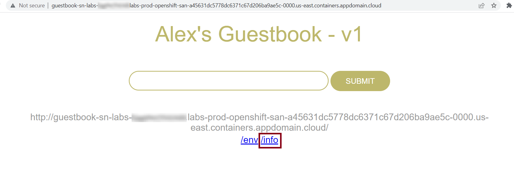 <br> <br>

Notice that it says "In-memory datastore (not redis)". Currently, we have only deployed the guestbook web front end, so it is using in-memory datastore to keep track of the entries. This is not very resilient, however, because any update or even a restart of the Pod will cause the entries to be lost. But let's confirm this.

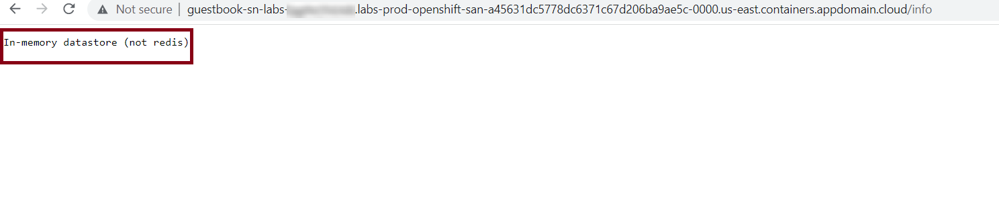 <br>

2. Return to the guestbook application in the browser by clicking the Route location again. You should see that your previous entries appear no more. This is because the guestbook was restarted when your update was deployed in the last section. We need a way to persist the guestbook entries even after restarts.

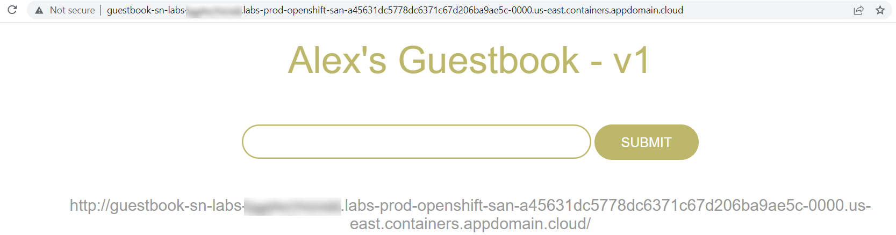 <br>

> **Note:** Currently we are experiencing certain difficulties with the OpenShift console. There is a possibility that you will see your old entries because the image stream takes time in updating. You may move ahead with the further steps of lab.

# Delete the guestbook
In order to deploy a more complex version of the guestbook, delete this simple version.

1. From the Topology view, click the `guestbook-app` application. This is the light gray circle that surrounds the `guestbook` Deployment.

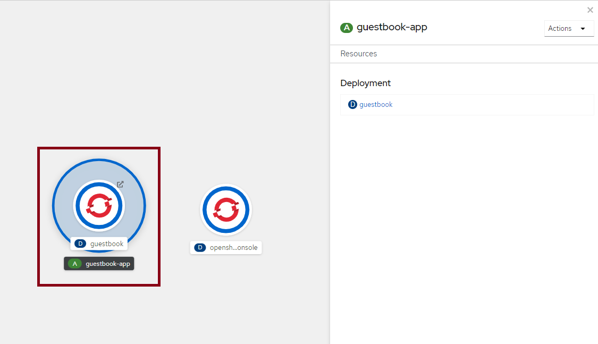 <br>

2. Click **Actions** > **Delete Application**.

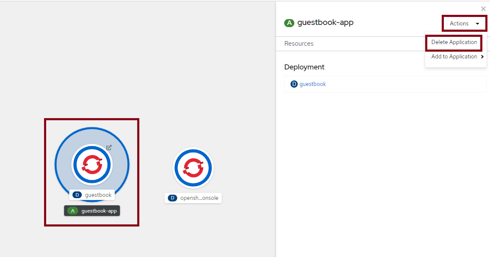 <br>

3. Type in the application name and click **Delete**.

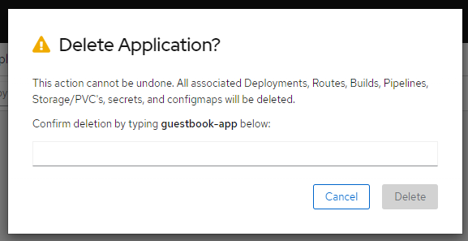 <br>

# Deploy Redis master and slave
We've demonstrated that we need persistent storage in order for the guestbook to be effective. Let's deploy Redis so that we get just that. Redis is an open source, in-memory data structure store, used as a database, cache and message broker.

This application uses the v2 version of the guestbook web front end and adds on 1) a Redis master for storage and 2) a replicated set of Redis slaves. For all of these components, there are Kubernetes Deployments, Pods, and Services. One of the main concerns with building a multi-tier application on Kubernetes is resolving dependencies between all of these separately deployed components.

In a multi-tier application, there are two primary ways that service dependencies can be resolved. The `v2/guestbook/main.go` code provides examples of each. For Redis, the master endpoint is discovered through environment variables. These environment variables are set when the Redis services are started, so the service resources need to be created before the guestbook Pods start. For the analyzer service, an HTTP request is made to a hostname, which allows for resource discovery at the time when the request is made. Consequently, we'll follow a specific order when creating the application components. First, the Redis components will be created, then the guestbook application, and finally the analyzer microservice.

> **Note:** If you have tried this lab earlier, there might be a possibility that the previous session is still persistent. In such a case, you will see an **'Unchanged'** message instead of the **'Created'** message when you run the **Apply** command for creating deployments. We recommend you to proceed with the next steps of the lab.

1. From the terminal in the lab environment, change to the v2 directory.
```
cd ../../v2
```
{: codeblock}

 <br>

2. Run the following command or open the `redis-master-deployment.yaml` in the Explorer to familiarize yourself with the Deployment configuration for the Redis master.
```
cat redis-master-deployment.yaml
```
{: codeblock}

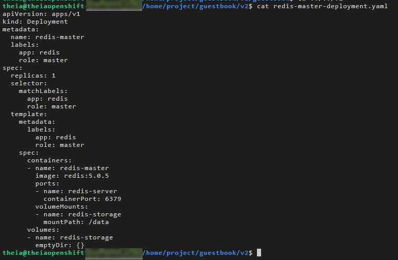 <br>

3. Create the Redis master Deployment.
```
oc apply -f redis-master-deployment.yaml
```
{: codeblock}

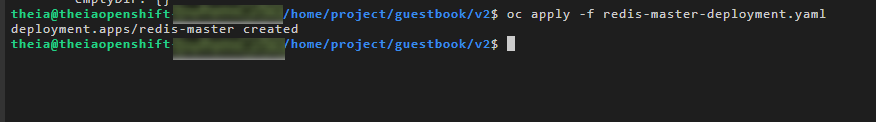 <br>

4. Verify that the Deployment was created.
```
oc get deployments
```
{: codeblock}

 <br>

5. List Pods to see the Pod created by the Deployment.
```
oc get pods
```
{: codeblock}

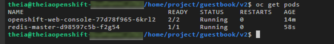 <br>

You can also return to the Topology view in the OpenShift web console and see that the Deployment has appeared there.

6. Run the following command or open the `redis-master-service.yaml` in the Explorer to familiarize yourself with the Service configuration for the Redis master.
```
cat redis-master-service.yaml
```
{: codeblock}

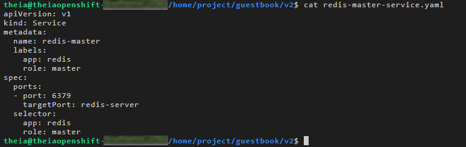 <br>

Services find the Pods to load balance based on Pod labels. The Pod that you created in previous step has the labels `app=redis` and `role=master`. The selector field of the Service determines which Pods will receive the traffic sent to the Service.

7. Create the Redis master Service.
```
oc apply -f redis-master-service.yaml
```
{: codeblock}

 <br>

If you click on the `redis-master` Deployment in the Topology view, you should now see the `redis-master` Service in the **Resources** tab.

 <br>

8. Run the following command or open the `redis-slave-deployment.yaml` in the Explorer to familiarize yourself with the Deployment configuration for the Redis slave.
```
cat redis-slave-deployment.yaml
```
{: codeblock}

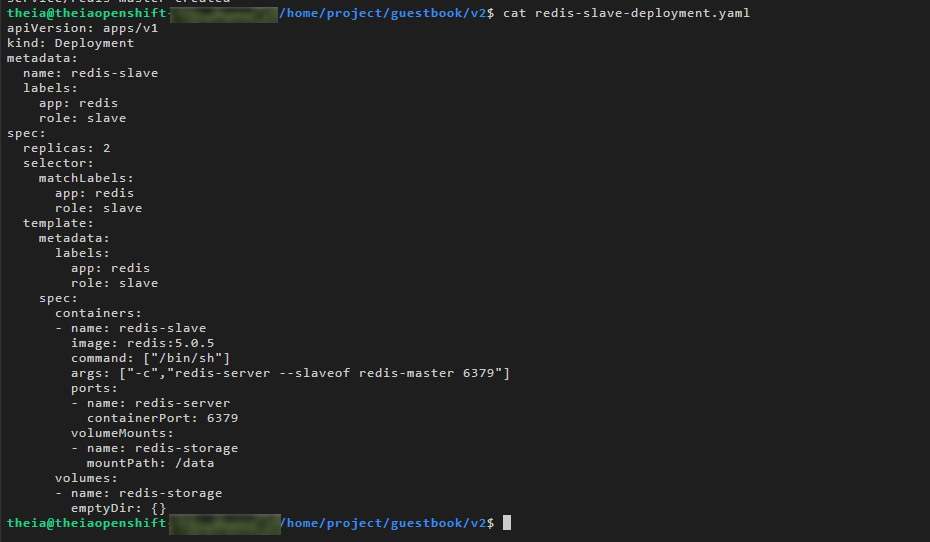 <br>

9. Create the Redis slave Deployment.
```
oc apply -f redis-slave-deployment.yaml
```
{: codeblock}

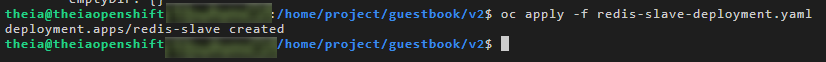 <br>

10. Verify that the Deployment was created.
```
oc get deployments
```
{: codeblock}

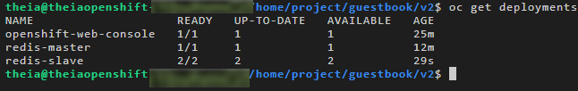 <br>

11. List Pods to see the Pod created by the Deployment.
```
oc get pods
```
{: codeblock}

 <br>

You can also return to the Topology view in the OpenShift web console and see that the Deployment has appeared there.

12. Run the following command or open the `redis-slave-service.yaml` in the Explorer to familiarize yourself with the Service configuration for the Redis slave.
```
cat redis-slave-service.yaml
```
{: codeblock}

 <br>

13. Create the Redis slave Service.
```
oc apply -f redis-slave-service.yaml
```
{: codeblock}

 <br>

If you click on the `redis-slave` Deployment in the Topology view, you should now see the `redis-slave` Service in the **Resources** tab.

 <br>

# Deploy v2 guestbook app
Now it's time to deploy the second version of the guestbook app, which will leverage Redis for persistent storage.

1. Click the **+Add** button to add a new application to this project.

 <br>

To demonstrate the various options available in OpenShift, we'll deploy this guestbook app using an OpenShift build and the Dockerfile from the repo.

2. Click the **From Dockerfile** option.

 <br>

3. Paste the below URL in the **Git Repo URL** box. 

```
https://github.com/ibm-developer-skills-network/guestbook
```
{: codeblock}

You should see a validated checkmark once you click out of the box.

> **Note: Ensure there are no spaces in the Git Repo URL that is to be copied.**

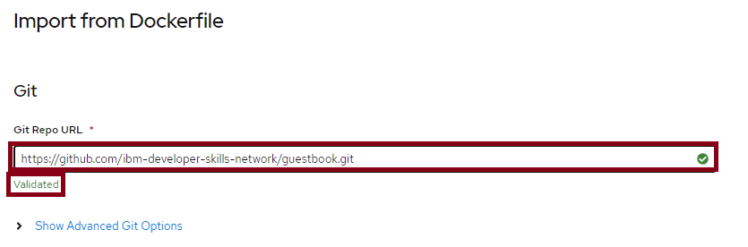 <br>

4. Click **Show Advanced Git Options**.

 <br>

5. Since the Dockerfile isn't at the root of the repository, we need to tell OpenShift where it is. Enter `/v2/guestbook` in the **Context Dir** box.

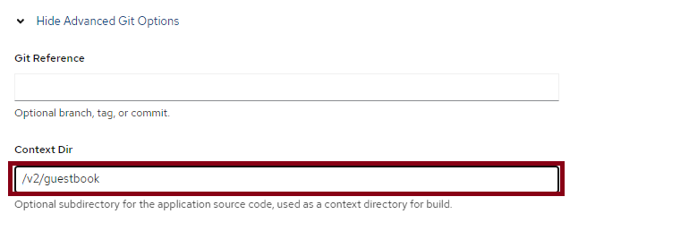 <br>

6. Under **Container Port**, enter 3000.

 <br>

7. Leave the rest of the default options and click **Create**.
Since we gave OpenShift a Dockerfile, it will create a BuildConfig and a Build that will build an image using the Dockerfile, push it to the internal registry, and use that image for a Deployment.

 <br><br>

8. From the Topology view, click the `guestbook` Deployment.


In the **Resources** tab, click the Route location to load the guestbook in the browser. Notice that the header says "Guestbook - v2" instead of "Guestbook - v1".

>> **Note: Please wait for the Builds to complete before clicking on the route link**

 <br> 

9. From the guestbook in the browser, click the `/info` link beneath the input box. 

 <br> <br>

Notice that it now gives information on Redis since we're no longer using the in-memory datastore.


 <br>


> **Note:** Please delete your project from Openshift Console & SN labs environment before signing out to ensure that further labs requiring the use of OpenShift console run correctly. To do the same, click on this <a href='https://cf-courses-data.s3.us.cloud-object-storage.appdomain.cloud/cc201/labs/4_IntroOpenShift/oc___snlabs_proj_deletion.md.html'>link</a>

## Changelog
| Date | Version | Changed by | Change Description |
|------|--------|--------|---------|
| 2022-04-12 | 1.1 | K Sundararajan | Updated Lab instructions |
| 2022-04-13 | 1.2 | K Sundararajan | Updated Lab instructions |
| 2022-04-14 | 1.3 | K Sundararajan | Updated Lab instructions |
| 2022-04-19 | 1.4 | K Sundararajan | Updated Lab instructions |
| 2022-07-25 | 1.5 | K Sundararajan | Updated Lab instructions |
| 2022-08-02 | 1.6 | K Sundararajan | Added new IDSN logo |

## <h3 align="center"> © IBM Corporation 2022. All rights reserved. <h3/>
