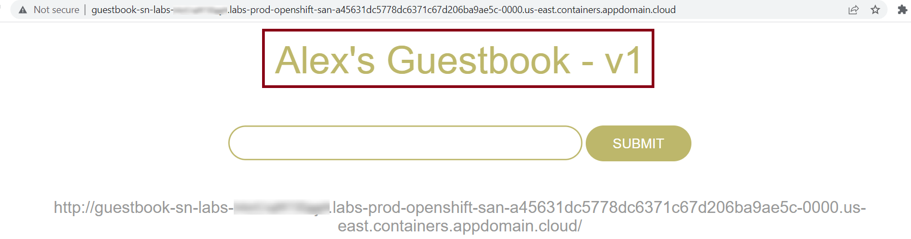
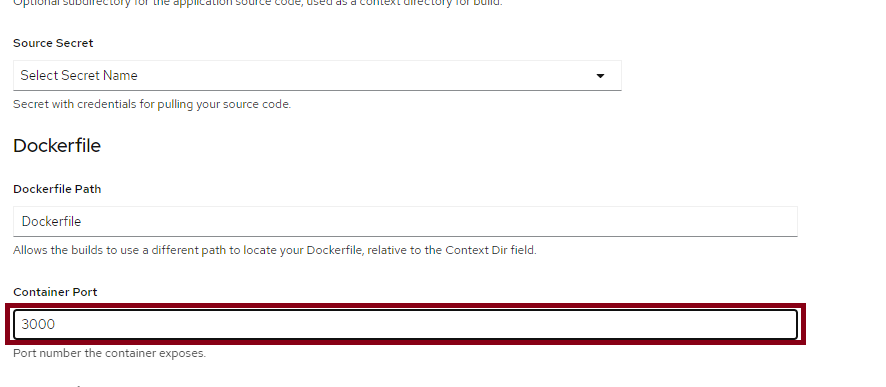
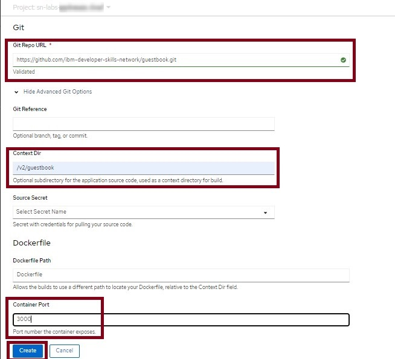
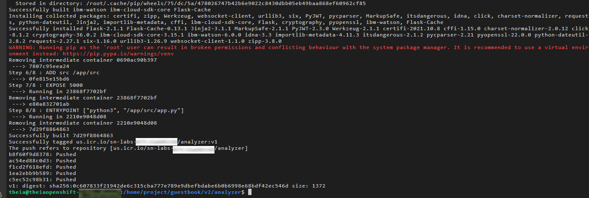
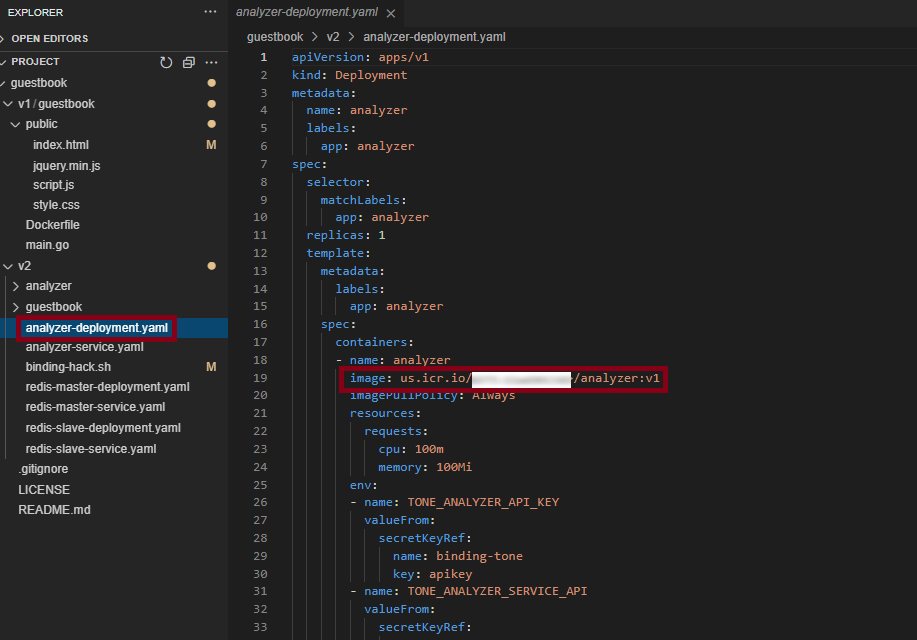
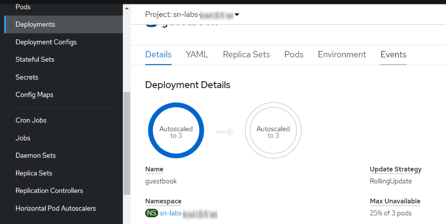

<center>

</center>

# Final Project

## Objectives
In this lab, you will:
- Build and deploy a simple guestbook application
- Use OpenShift image streams to roll out an update
- Deploy a multi-tier version of the guestbook application
- Create a Watson Natural Language Understanding service instance on IBM Cloud
- Bind the Natural Language Understanding service instance to your application
- Autoscale the guestbook app

# Project Overview

## Guestbook application
Guestbook is a simple, multi-tier web application that we will build and deploy with Docker and Kubernetes. The application consists of a web front end, a Redis master for storage, a replicated set of Redis slaves, and a Natural Language Understanding service that will analyze the tone of the comments left in the guestbook. For all of these we will create Kubernetes Deployments, Pods, and Services.

There are two versions of this application. Version 1 (in the v1 directory) is the simple application itself, while version 2 (in the v2 directory) extends the application by adding additional features that leverage the Watson Natural Language Understanding service.

We will deploy and manage this entire application on OpenShift.

# Verify the environment and command line tools
1. If a terminal is not already open, open a terminal window by using the menu in the editor: `Terminal > New Terminal`.

 <br>

2. Change to your project folder.

>> **Note: If you are already on the `/home/project` folder, please skip this step.**

```
cd /home/project
```
{: codeblock}

3. Clone the git repository that contains the artifacts needed for this lab.
```
git clone https://github.com/ibm-developer-skills-network/guestbook.git
```
{: codeblock}

 <br>

4. Change to the directory for this lab.
```
cd guestbook
```
{: codeblock}

5. List the contents of this directory to see the artifacts for this lab.
```
ls
```
{: codeblock}

 <br>

# Build the guestbook app
To begin, we will build and deploy the web front end for the guestbook app.

1. Change to the `v1/guestbook` directory.
```
cd v1/guestbook
```
{: codeblock}

2. Run the following command or open the Dockerfile in the Explorer to familiarize yourself with it. The path to this file is `guestbook/v1/guestbook/Dockerfile`. This Dockerfile incorporates a more advanced strategy called multi-stage builds, so feel free to read more about that [here](https://docs.docker.com/develop/develop-images/multistage-build/).
```
cat Dockerfile
```
{: codeblock}

 <br>

3. Export your namespace as an environment variable so that it can be used in subsequent commands. 
```
export MY_NAMESPACE=sn-labs-$USERNAME
```
{: codeblock}

 <br>

4. Build the guestbook app.
```
docker build . -t us.icr.io/$MY_NAMESPACE/guestbook:v1
```
{: codeblock}

 <br>

5. Push the image to IBM Cloud Container Registry.
```
docker push us.icr.io/$MY_NAMESPACE/guestbook:v1
```
{: codeblock}

 <br>

6. Verify that the image was pushed successfully.
```
ibmcloud cr images
```
{: codeblock}

 <br>

# Deploy guestbook app from the OpenShift internal registry
As discussed in the course, IBM Cloud Container Registry scans images for common vulnerabilities and exposures to ensure that images are secure. But OpenShift also provides an internal registry -- recall the discussion of image streams and image stream tags. Using the internal registry has benefits too. For example, there is less latency when pulling images for deployments. What if we could use both—use IBM Cloud Container Registry to scan our images and then automatically import those images to the internal registry for lower latency?

1. Create an image stream that points to your image in IBM Cloud Container Registry.
```
oc tag us.icr.io/$MY_NAMESPACE/guestbook:v1 guestbook:v1 --reference-policy=local --scheduled
```
{: codeblock}

With the `--reference-policy=local` option, a copy of the image from IBM Cloud Container Registry is imported into the local cache of the internal registry and made available to the cluster's projects as an image stream. The `--schedule` option sets up periodic importing of the image from IBM Cloud Container Registry into the internal registry. The default frequency is 15 minutes.

 <br>

Now let's head over to the OpenShift web console to deploy the guestbook app using this image stream.

2. Open the OpenShift web console using the link at the top of the lab environment.

 <br>

3. From the Developer perspective, click the **+Add** button to add a new application to this project.

 <br>

4. Click the **Container Image** option so that we can deploy the application using an image in the internal registry.

 <br>

5. Under **Image**, switch to "**Image stream tag from internal registry**".

 <br>

6. Select your project, and the image stream and tag you just created (`guestbook` and `v1`, respectively). You should have only have one option for each of these fields anyway since you only have access to a single project and you only created one image stream and one image stream tag.

 <br>

7. Keep all the default values and hit **Create** at the bottom. This will create the application and take you to the Topology view.

 <br>

8. From the Topology view, click the `guestbook` Deployment. This should take you to the **Resources** tab for this Deployment, where you can see the Pod that is running the application as well as the Service and Route that expose it.

 <br>

>> **Note: Kindly do not delete the `opensh.console` deployment in the Topogrpahy view as this is essential for the OpenShift console to function properly.**

9. Click the Route location (the link) to view the guestbook in action. **Kindly take the screenshot of the guestbook for the final assignment.**

 <br>

10. Try out the guestbook by putting in a few entries. You should see them appear above the input box after you hit **Submit**.

 <br>

# Update the guestbook
Let's update the guestbook and see how OpenShift's image streams can help us update our apps with ease.

1. Use the Explorer to edit `index.html` in the `public` directory. The path to this file is `guestbook/v1/guestbook/public/index.html`.

 <br>

2. Let's edit the title to be more specific. On the line that says `<h1>Guestbook - v1</h1>`, change it to include your name. Something like `<h1>Alex's Guestbook - v1</h1>`. Make sure to save the file when you're done.

 <br>

3. Build and push the app again using the same tag. This will overwrite the previous image.
```
docker build . -t us.icr.io/$MY_NAMESPACE/guestbook:v1 && docker push us.icr.io/$MY_NAMESPACE/guestbook:v1
```
{: codeblock}

 <br>

4. Recall the `--schedule` option we specified when we imported our image into the OpenShift internal registry. As a result, OpenShift will regularly import new images pushed to the specified tag. Since we pushed our newly built image to the same tag, OpenShift will import the updated image within about 15 minutes. If you don't want to wait for OpenShift to automatically import the image, run the following command.
```
oc import-image guestbook:v1 --from=us.icr.io/$MY_NAMESPACE/guestbook:v1 --confirm
```
{: codeblock}

 <br>

5. Switch to the **Administrator** perspective so that you can view image streams.

 <br>

6. Click **Builds** > **Image Streams** in the navigation.

 <br>

7. Click the `guestbook` image stream.

 <br>

8. Click the **History** menu. If you only see one entry listed here, it means OpenShift hasn't imported your new image yet. Wait a few minutes and refresh the page. Eventually you should see a second entry, indicating that a new version of this image stream tag has been imported. This can take some time as the default frequency for importing is 15 minutes. **Kindly take the screenshot of the image stream showing two distinct version for the final assignment.**

 <br>

9. Return to the **Developer** perspective.

 <br>

>> **Note: Please wait for some time for the OpenShift console & the Developer perspective to load.**

10. View the guestbook in the browser again. If you still have the tab open, go there. If not, click the Route again from the `guestbook` Deployment. You should see your new title on this page! OpenShift imported the new version of our image, and since the Deployment points to the image stream, it began running this new version as well. **Kindly take the screenshot of the updated guestbook for the final assignment.**

 <br>

# Guestbook storage
1. From the guestbook in the browser, click the `/info` link beneath the input box. This is an information endpoint for the guestbook.

 <br>

 Notice that it says "In-memory datastore (not redis)". Currently, we have only deployed the guestbook web front end, so it is using in-memory datastore to keep track of the entries. This is not very resilient, however, because any update or even a restart of the Pod will cause the entries to be lost. But let's confirm this. **Kindly take the screenshot of the In-memory datastore for the final assignment.**

 <br>

2. Return to the guestbook application in the browser by clicking the Route location again. You should see that your previous entries appear no more. This is because the guestbook was restarted when your update was deployed in the last section. We need a way to persist the guestbook entries even after restarts.

 <br>

# Delete the guestbook
In order to deploy a more complex version of the guestbook, delete this simple version.

1. From the Topology view, click the `guestbook-app` application. This is the light gray circle that surrounds the `guestbook` Deployment.

 <br>

2. Click **Actions** > **Delete Application**.

 <br>

3. Type in the application name and click **Delete**.

 <br>

# Deploy Redis master and slave
We've demonstrated that we need persistent storage in order for the guestbook to be effective. Let's deploy Redis so that we get just that. Redis is an open source, in-memory data structure store, used as a database, cache and message broker.

This application uses the v2 version of the guestbook web front end and adds on 1) a Redis master for storage, 2) a replicated set of Redis slaves, and 3) a Python Flask application that calls a Watson Natural Language Understanding service deployed in IBM Cloud to analyze the tone. For all of these components, there are Kubernetes Deployments, Pods, and Services. One of the main concerns with building a multi-tier application on Kubernetes is resolving dependencies between all of these separately deployed components.

In a multi-tier application, there are two primary ways that service dependencies can be resolved. The `v2/guestbook/main.go` code provides examples of each. For Redis, the master endpoint is discovered through environment variables. These environment variables are set when the Redis services are started, so the service resources need to be created before the guestbook Pods start. For the analyzer service, an HTTP request is made to a hostname, which allows for resource discovery at the time when the request is made. Consequently, we'll follow a specific order when creating the application components. First, the Redis components will be created, then the guestbook application, and finally the analyzer microservice.

1. From the terminal in the lab environment, change to the v2 directory.
```
cd ../../v2
```
{: codeblock}

 <br>

2. Run the following command or open the `redis-master-deployment.yaml` in the Explorer to familiarize yourself with the Deployment configuration for the Redis master.
```
cat redis-master-deployment.yaml
```
{: codeblock}

 <br>

3. Create the Redis master Deployment.
```
oc apply -f redis-master-deployment.yaml
```
{: codeblock}

 <br>

4. Verify that the Deployment was created.
```
oc get deployments
```
{: codeblock}

 <br>

5. List Pods to see the Pod created by the Deployment.
```
oc get pods
```
{: codeblock}

 <br>

You can also return to the Topology view in the OpenShift web console and see that the Deployment has appeared there.

6. Run the following command or open the `redis-master-service.yaml` in the Explorer to familiarize yourself with the Service configuration for the Redis master.
```
cat redis-master-service.yaml
```
{: codeblock}

 <br>

Services find the Pods to load balance based on Pod labels. The Pod that you created in previous step has the labels `app=redis` and `role=master`. The selector field of the Service determines which Pods will receive the traffic sent to the Service.

7. Create the Redis master Service.
```
oc apply -f redis-master-service.yaml
```
{: codeblock}

 <br>

If you click on the `redis-master` Deployment in the Topology view, you should now see the `redis-master` Service in the **Resources** tab.

 <br>

8. Run the following command or open the `redis-slave-deployment.yaml` in the Explorer to familiarize yourself with the Deployment configuration for the Redis slave.
```
cat redis-slave-deployment.yaml
```
{: codeblock}

 <br>

9. Create the Redis slave Deployment.
```
oc apply -f redis-slave-deployment.yaml
```
{: codeblock}

 <br>

10. Verify that the Deployment was created.
```
oc get deployments
```
{: codeblock}

 <br>

11. List Pods to see the Pod created by the Deployment.
```
oc get pods
```
{: codeblock}

 <br>

You can also return to the Topology view in the OpenShift web console and see that the Deployment has appeared there.

12. Run the following command or open the `redis-slave-service.yaml` in the Explorer to familiarize yourself with the Service configuration for the Redis slave.
```
cat redis-slave-service.yaml
```
{: codeblock}

 <br>

13. Create the Redis slave Service.
```
oc apply -f redis-slave-service.yaml
```
{: codeblock}

 <br>

If you click on the `redis-slave` Deployment in the Topology view, you should now see the `redis-slave` Service in the **Resources** tab.

 <br>

# Deploy v2 guestbook app
Now it's time to deploy the second version of the guestbook app, which will leverage Redis for persistent storage.

1. Click the **+Add** button to add a new application to this project.

 <br>

To demonstrate the various options available in OpenShift, we'll deploy this guestbook app using an OpenShift build and the Dockerfile from the repo.

2. Click the **From Dockerfile** option.

 <br>

3. Paste the URL **https://github.com/ibm-developer-skills-network/guestbook.git** in the **Git Repo URL** box. You should see a validated checkmark once you click out of the box.

 <br>

4. Click **Show Advanced Git Options**.

 <br>

5. Since the Dockerfile isn't at the root of the repository, we need to tell OpenShift where it is. Enter `/v2/guestbook` in the **Context Dir** box.

 <br>

6. Under **Container Port**, enter 3000.

 <br>

7. Leave the rest of the default options and click **Create**.
Since we gave OpenShift a Dockerfile, it will create a BuildConfig and a Build that will build an image using the Dockerfile, push it to the internal registry, and use that image for a Deployment.



8. From the Topology view, click the `guestbook` Deployment. **Kindly take the screenshot of the guestbook deployment showing Build along with Service and Route for the final assignment.** In the **Resources** tab, click the Route location to load the guestbook in the browser. Notice that the header says "Guestbook - v2" instead of "Guestbook - v1".

 <br>

9. From the guestbook in the browser, click the `/info` link beneath the input box. 

 <br>

Notice that it now gives information on Redis since we're no longer using the in-memory datastore. **Kindly take the screenshot of the `/info` showing redis instead of in-memory datastore for the final assignment.**

 <br>

# Login to IBM CLOUD

>**Note:** In the prework you have already created an Natural Language Understanding service instance. Kindly note the service name as it will be required.

1. We need to store these credentials in a Kubernetes secret in order for our analyzer microservice to utilize them. From the terminal in the lab environment, login to your IBM Cloud account with your username. When prompted enter you password to login.
```
ibmcloud login -u <your_email_address> 
```
{: codeblock}

 <br>

>If you are a federated user that uses a corporate or enterprise single sign-on ID, you can log in to IBM Cloud® from the console by using a federated ID and password. Use the provided URL in your CLI output to retrieve your one-time passcode. You know you have a federated ID when the login fails without the `--sso` and succeeds with the `--sso` option.

2. Ensure that you target the resource group in which you created the Natural Language Understanding service. Remember that you noted this resource group in a previous step.
```
ibmcloud target -g <resource_group>
```
{: codeblock}

 <br>

3. Use the Explorer to edit `binding-hack.sh`. The path to this file is `guestbook/v2/binding-hack.sh`. You need to insert the name of your IBM Cloud Natural Language Understanding service where it says `<your nlu service name>`. You need to insert your OpenShift project where it says `<my_project>`.

 <br>

 If you don't remember your project name, run `oc project`. Make sure to save the file when you're done.

  <br>

4. Run the script to create a Secret containing credentials for your Natural Language Understanding  service.
```
./binding-hack.sh
```
{: codeblock}

You should see the following output: `secret/tone-binding created`.

 <br>

10. Log back into the lab account.
```
ibmcloud login --apikey $IBMCLOUD_API_KEY
```
{: codeblock}

 <br>

# Deploy the analyzer microservice
Now that the Natural Language Understanding service is created and its credentials are provided in a Kubernetes Secret, we can deploy the analyzer microservice.

1. Change to the `analyzer` directory.
```
cd analyzer
```
{: codeblock}

2. Build and push the analyzer image.
```
docker build . -t us.icr.io/$MY_NAMESPACE/analyzer:v1 && docker push us.icr.io/$MY_NAMESPACE/analyzer:v1
```
{: codeblock}

 <br>

 <br>

3. Return to the `v2` directory.
```
cd ..
```
{: codeblock}

4. Use the Explorer to edit `analyzer-deployment.yaml`. The path to this file is `guestbook/v2/analyzer-deployment.yaml`. You need to insert your Container Registry namespace where it says `<my_namespace>`. 

 <br>

If you don't remember your namespace, run `echo $MY_NAMESPACE`. Make sure to save the file when you're done. Also notice the `env` section, which indicates that environment variables will be set using the `binding-tone` Secret you created.

 <br>

5. Create the `analyzer` Deployment.
```
oc apply -f analyzer-deployment.yaml
```
{: codeblock}

 <br>

6. Create the `analyzer` Service.
```
oc apply -f analyzer-service.yaml
```
{: codeblock}

 <br>

7. **Kindly take the screenshot of the topology showing "redis-master,redis slave and analyzer microservices" for the final assignment**. 

 <br>

Return to the guestbook in the browser, refresh the page, and submit a new entry. You should see your entry appear along with a tone analysis.

 <br>

8. **Kindly take the screenshot of the entries to the guestbook and have their tone analyzed. Some simple sentences will not have a tone detected. Ensure that you submit something complex enough so that its tone is detected.**

 <br>

# Autoscale guestbook
Now that guestbook is successfully up and running, let's set up a horizontal pod autoscaler (HPA) so that it can handle any load that comes its way. Make sure to keep the guestbook open in a browser tab so that it continues to make requests and consume resources so that it can be successfully autoscaled.

First, we need to set resource requests and limits for the containers that will run. If a container requests a resource like CPU or memory, Kubernetes will only schedule it on a node that can give it that resource. On the other hand, limits prevent a container from consuming more than a certain amount of a resource.

In this case, we're going to request 3 millicores of CPU and 40 MB of RAM. We'll limit the containers to 30 millicores and 100 MB. These numbers are contrived in order to ensure that the app scales.

1. From the Topology view, click the `guestbook` Deployment. Then click **Actions** > **Edit Deployment**.

 <br>

2. In the **template.spec.containers** section, find `resources: {}`. Replace that with the following text. Make sure the spacing is correct as YAML uses strict indentation.
```
          resources:
            limits:
              cpu: 30m
              memory: 100Mi
            requests:
              cpu: 3m
              memory: 40Mi
```
{: codeblock}

 <br>

3. Click **Save**.

 <br>

4. Switch to the Administrator perspective.

 <br>

5. Select **Workloads** > **Horizontal Pod Autoscalers**.

 <br>

6. Click **Create Horizontal Pod Autoscaler**.

 <br>

7. Paste the following YAML into the editor.
```
apiVersion: autoscaling/v2beta1
kind: HorizontalPodAutoscaler
metadata:
  name: guestbook-hpa
spec:
  scaleTargetRef:
    apiVersion: apps/v1
    kind: Deployment
    name: guestbook
  minReplicas: 1
  maxReplicas: 3
  metrics:
    - type: Resource
      resource:
        name: cpu
        targetAverageUtilization: 1
```
{: codeblock}

 <br>

This HPA indicates that we're going to scale based on CPU usage. Generally you want to scale when your CPU utilization is in the 50-90% range. For this example, we're going to use 1% so that the app is more likely to need scaling. The `minReplicas` and `maxReplicas` fields indicate that the Deployment should have between one and three replicas at any given time depending on load.

8. Click **Create**.

 <br>

9. If you wait, you'll see both **Current Replicas** and **Desired Replicas** become three. This is because the HPA detected sufficient load to trigger a scale up to the maximum number of Pods, which is three. You can also view the **Last Scale Time** as well as the current and target CPU utilization. The target is obviously 1% since that's what we set it to. Note that it can take a few minutes to trigger the scale up. **Kindly take the screenshot of Horizontal Pod Autoscaler that shows guestbook as the scale target, the current and desired replicas as three, and the last scale time as the time the deployment was scaled up to three replicas.**

 <br>

10. If you click the `guestbook` Deployment under **Scale Target**, you'll be directed to the Deployment where you can verify that there are now three Pods.

 <br>

Congratulations! You have completed the final project for this course. Do not log out of the lab environment (you can close the browser though) or delete any of the artifacts created during the lab, as these will be needed for grading.
