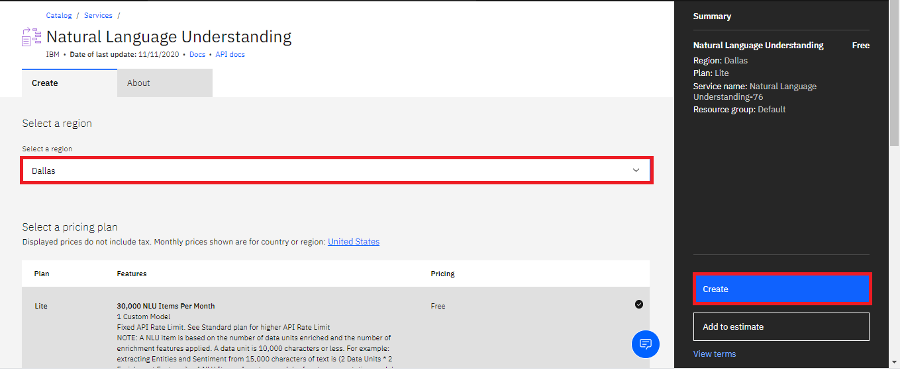

---
markdown-version:
tool-type: instructional-lab
branch: lab-2811-instruction
version-history-start-date: '2022-12-15T12:07:18Z'
---

# Prework: Creating an IBM Cloud account and NLU service

**Estimated time needed:** 30 minutes

## Lab Overview

**Watson Natural Language Understanding** offers a suite of features for text analysis. The Watson Natural Language Understanding analyze text to extract metadata from content such as concepts, entities, keywords, categories, sentiment, emotion, relations, and semantic roles using natural language understanding.

## Objectives

After completing this lab, you will be able to:

1. Log into IBM Cloud with your new IBMid.
2. Create a Watson Natural Language Understanding service in IBM Cloud.
 
## Pre-requisites
You will need an IBM Cloud account to do this lab. If you have not created one already, click on this [link](https://cf-courses-data.s3.us.cloud-object-storage.appdomain.cloud/IBM-CC0100EN-SkillsNetwork/labs/IBMCloud_accountCreation/CreateIBMCloudAccount.md.html) and follow the instructions to create an IBM Cloud account.

## Create an instance of Natural Language Understanding service

1. Log into you IBM cloud account with your credentials. Go to the [Catalog](https://cloud.ibm.com/catalog) page, click on the **Services** , select the **AI/ Machine learning** category and then select the **Natural Language Understanding** resource.

 
2. On the Natural Language Understanding page, select **DALLAS** as the Region, verify that the **Lite** plan is selected, and then click **Create**.

# Checklist for lab completion

1. You have an IBM cloud account

2. You have a Watson NLU service created in your IBM Cloud

**Congratulations!** You've now signed into your IBM Cloud account and created an NLU service.
