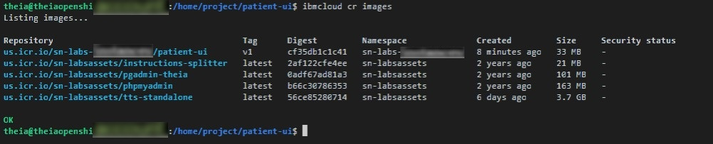

<center>

</center>

# Final Project

## Objectives
In this lab, you will:

- Build and deploy a simple health application
- Autoscale the Health application using Horizontal Pod    Autoscaler
- Perform Rolling Updates and Rollbacks


# Project Overview

## Health application
Health application is a simple web application that we will build and deploy with Docker and Kubernetes. The application consists of a web front end which will have a text input where you can enter login details. For all of these we will create Kubernetes Deployments and Pods. Then we will apply Horizontal Pod Scaling to the health application and finally work on Rolling Updates and Rollbacks.

# Verify the environment and command line tools
1. If a terminal is not already open, open a terminal window by using the menu in the editor: `Terminal > New Terminal`.

> **Note:** Please wait for some time for the terminal prompt to appear.

 <br>

2. Change to your project folder.

>> **Note: If you are already on the `/home/project` folder, please skip this step.**

```
cd /home/project
```
{: codeblock}

3. Clone the git repository that contains the artifacts needed for this lab.
```
git clone https://github.com/ajp-io/patient-ui.git
```
{: codeblock}

 <br>

4. Change to the directory for this lab.
```
cd patient-ui
```
{: codeblock}

5. List the contents of this directory to see the artifacts for this lab.
```
ls
```
{: codeblock}


# Build the health app
To begin, we will build and deploy the web front end for the health app.

1. Open the Dockerfile from the file explorer.

2. Dockerfile incorporates a more advanced strategy called multi-stage builds, so feel free to read more about that [here](https://docs.docker.com/develop/develop-images/multistage-build/).

Complete the Dockerfile with the necessary Docker commands to build and push your image. The path to this file is `patient-ui/Dockerfile`.

<details>
<summary>Hint!</summary>
The FROM instruction initializes a new build stage and specifies the base image that subsequent instructions will build upon.<br>
The COPY command enables us to copy files to our image. <br>
The COPY command enables us to copy files to our image. <br>
The RUN instruction executes commands.<br>
The CMD instruction provides a default for executing a container, or in other words, an executable that should run in your container.<br>
</details>

> Copy the code of the completed dockerfile with you. You will be prompted to submit it in the text box in the Peer Assignment.

3. Export your namespace as an environment variable so that it can be used in subsequent commands. 
```
export MY_NAMESPACE=sn-labs-$USERNAME
```
{: codeblock}

 <br>

4. Build the health app using the Docker Build command.
<details>

<summary>Hint!</summary>

```
docker build . -t us.icr.io/$MY_NAMESPACE/patient-ui:v1
```
{: codeblock}

<br>
 <br>


</details>

5. Push the image to IBM Cloud Container Registry.

<details>

<summary>Hint!</summary>


```
docker push us.icr.io/$MY_NAMESPACE/patient-ui:v1
```
{: codeblock}

 <br>


</details>

> **Note:** If you have tried this lab earlier, there might be a possibility that the previous session is still persistent. In such a case, you will see a **'Layer already Exists'** message instead of the **'Pushed'** message  in the above output. We recommend you to proceed with the next steps of the lab.

6. Verify that the image was pushed successfully.
```
ibmcloud cr images
```
{: codeblock}

 <br>

> **Note:** If you see the status of the image as **'Scanning'**, please wait for 10 minutes & re-run the above command till the status gradually changes to **'No Issues'**. Even if status shows as **'1 issue'**, you can still proceed with lab.

>📷 Take a screenshot of the output of Step 6 and save it as a .jpg or .png with the filename `crimages.png`. You will be prompted to upload the screenshot in the Peer Assignment.

7. Create a new file with `deployment.yml` file in the `patient-ui` directory & paste the code for the deployment of the application:

```
apiVersion: apps/v1
kind: Deployment
metadata:
  name: patient-ui
  labels:
    app: patient-ui
spec:
  replicas: 1
  selector:
    matchLabels:
      app: patient-ui
  strategy:
    rollingUpdate:
      maxSurge: 25%
      maxUnavailable: 25%
    type: RollingUpdate
  template:
    metadata:
      labels:
        app: patient-ui
    spec:
      containers:
      - image: us.icr.io/<your sn labs namespace>/patient-ui:v1
        imagePullPolicy: Always
        name: patient-ui
        ports:
        - containerPort: 8080
          name: http
        resources:
          limits:
            cpu: 50m
          requests:
            cpu: 20m  
  
```
{: codeblock}

> **Note:** Replace `<your sn labs namespace>` with your SN labs namespace. To check your SN labs namespace, please run the command `ibmcloud cr namespaces`

- It should look as below:

 <br>

8. Apply the deployment using:

```
kubectl apply -f deployment.yml
```
{: codeblock}

9. Open a New Terminal and enter the below command to view your application:

```
kubectl port-forward deployment.apps/patient-ui 8080:8080
```
{: codeblock}

 <br>

10. Launch your application on port 8080. Click on the Skills Network button on the right, it will open the **“Skills Network Toolbox”**. Then click the **Other** then **Launch Application**. From there you should be able to enter the port and launch.

 <br>

11. Now you should be able to see your running application. Please copy the app URL which will be given as below:

 <br>

>📷 Take a screenshot of your deployed application and save it as a .jpg or .png with the filename `app.png`. You will be prompted to upload the screenshot in the Peer Assignment.

12. Log into the health app using any credentials. Since the app is in demo mode right now, it will accept any credentials you enter.

# Autoscale the Health application using Horizontal Pod Autoscaler

1. Autoscale the health application deployment using `kubectl autoscale deployment`

<details>

<summary>Hint!</summary>

```
kubectl autoscale deployment patient-ui --cpu-percent=5 --min=1 --max=10
```
{: codeblock}

 <br>

</details>


2. You can check the current status of the newly-made HorizontalPodAutoscaler, by running:

```
kubectl get hpa patient-ui
```
{: codeblock}

The current replicas is 0 as there is no load on the server.

>📷 Take a screenshot of your Horizontal Pod Autoscaler and save it as a .jpg or .png with the filename `hpa.png`. You will be prompted to upload the screenshot in the Peer Assignment.


2. Open another new terminal and enter the below command to generate load on the app to observe the autoscaling (Please ensure your port-forward command is running. In case you have stopped your application, please run the port-forward command to re-run the application at port 3000.)

```
kubectl run -i --tty load-generator --rm --image=busybox:1.35.0 --restart=Never -- /bin/sh -c "while sleep 0.01; do wget -q -O- <your app URL>; done"
```
{: codeblock}

- Please replace your app URL in the `<your app URL>` part of the above command.

> Note: Use the same copied URL which you obtained in step 11 of the previous task.

The command will be as below:

 <br>

> **Note:** In case you get a `Load generator already exists` error, please suffix a number after `load-generator` eg. `load-generator-1`, `load-generator-2`.

- You will keep getting an output similar as below which will indicate the increasing load on the app:

 <br>

> **Note:** Continue further commands in the 1st terminal

3. Run the below command to observe the replicas increase in accordance with the autoscaling:

```
kubectl get hpa patient-ui --watch
```
{: codeblock}

4. Run the above command again after 5-10 minutes and you will see an increase in the number of replicas which shows that your application has been autoscaled.

 <br>

>📷 Take a screenshot of your Autoscaler details and save it as a .jpg or .png with the filename `hpa2.png`. You will be prompted to upload the screenshot in the Peer Assignment.

5. Run the below command to observe the details of the horizontal pod autoscaler:

```
kubectl get hpa patient-ui
```
{: codeblock}

 <br>

- Please close the other terminals where load generator and port-forward commands are running.


# Perform Rolling Updates and Rollbacks on the Health application

> **Note:** Please run all the commands in the 1st terminal unless mentioned to use a new terminal.

1. Use the Explorer to edit login.html in the public directory. The path to this file is patient-ui/public/login.html.

2. Let’s edit the name beneath the logo to be more specific. On the line that says `<div class="Fictionalname">Example Health</div>`, change it to include your name. Something like `<div class="Fictionalname">Alex's Example Health</div>`. Make sure to save the file when you’re done.

<details>
<summary>Hint!</summary>

 <br>

</details>

2. Run the below command to build and push your updated app image:

<details>
<summary>Hint!</summary>

```
docker build . -t us.icr.io/$MY_NAMESPACE/patient-ui:v1 && docker push us.icr.io/$MY_NAMESPACE/patient-ui:v1
```
{: codeblock}

</details>

>📷 Take a screenshot of your updated image and save it as a .jpg or .png with the filename `uphealth.png`. You will be prompted to upload the screenshot in the Peer Assignment.

3. Update the values of the CPU in the `deployment.yml` to **cpu: 5m** and **cpu: 2m** as below:

<details>
<summary>Hint!</summary>

 <br>

</details>

4. Apply the changes to the `deployment.yml` file.

<details>
<summary>Hint!</summary>

```
kubectl apply -f deployment.yml
```
{: codeblock}

 <br>

</details>

>📷 Take a screenshot of the details of the output of Step 4 and save it as a .jpg or .png with the filename `deployment.png`. You will be prompted to upload the screenshot in the Peer Assignment.

5. Open a new terminal and run the port-forward command again to start the app:

```
kubectl port-forward deployment.apps/patient-ui 8080:808
```
{: codeblock}

 <br>


6. Launch your application on port 3000. Click on the Skills Network button on the right, it will open the **“Skills Network Toolbox”**. Then click the **Other** then **Launch Application**. From there you should be able to enter the port and launch.

 <br>


7. You will notice the updated app content as below:

 <br>

>📷 Take a screenshot of your updated application and save it as a .jpg or .png with the filename `up-app.png`. You will be prompted to upload the screenshot in the Peer Assignment.

> **Note:** Please stop the application before running the next steps.

8. Run the below command to see the history of deployment rollouts:

```
kubectl rollout history deployment/patient-ui
```
{: codeblock}

 <br>

6. Run the below command to see the details of Revision of the deployment rollout:

```
kubectl rollout history deployments patient-ui --revision=2
```
{: codeblock}

 <br>

>📷 Take a screenshot of the details of the correct Revision and save it as a .jpg or .png with the filename `rev.png`. You will be prompted to upload the screenshot in the Peer Assignment.

7. Run the below command to get the replica sets and observe the deployment which is being used now:

```
kubectl get rs
```
{: codeblock}

 <br>

8. Run the below command to undo the deploymnent and set it to Revision 1:

```
kubectl rollout undo deployment/patient-ui --to-revision=1
```
{: codeblock}


9. Run the below command to get the replica sets after the Rollout has been undone. The deployment being used would have changed as below:

```
kubectl get rs
```
{: codeblock}


>📷 Take a screenshot of the output of Step 9 and save it as a .jpg or .png with the filename `rs.png`. You will be prompted to upload the screenshot in the Peer Assignment.

Congratulations! You have completed the final project for this course. Do not log out of the lab environment (you can close the browser though) or delete any of the artifacts created during the lab, as these will be needed for grading.


## Changelog
| Date | Version | Changed by | Change Description |
|------|--------|--------|---------|
| 2022-11-16 | 1.0 | Saptahshree K s | Created Lab instructions |


## <h3 align="center"> © IBM Corporation 2022. All rights reserved. <h3/>
